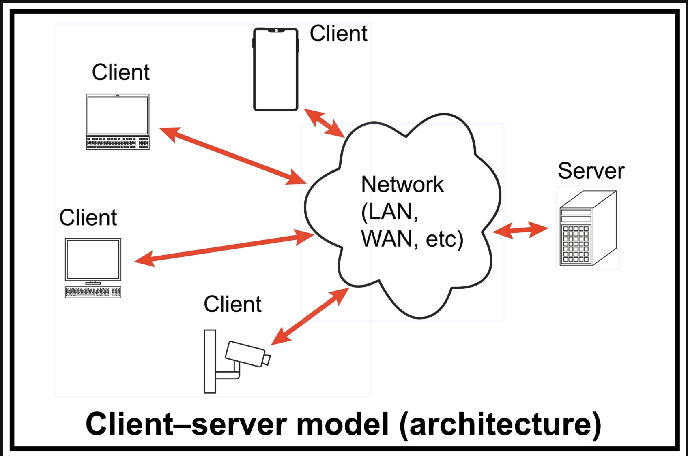

# Lab1: Building a HTTP Server from First Principles

## Introduction

In this lab, you will demystify the World Wide Web. You won't be using frameworks like Flask, Django, or Express. Instead, you will build a web server from scratch using Raw Sockets.

The Goal: Build a server that listens for connections, parses raw HTTP text, and maintains a persistent count of how many times it has been accessed.

### The Theory

At its core, the Web is just text sent over a TCP connection.

Client (Browser): Opens a connection and sends a text block (Request).

Server (You): Accepts connection, reads text, sends a text block back (Response), and closes the connection.


## Setup & Tooling

Using uv (Python Manager)

We recommend using uv to manage your Python environment. It ensures you are running the correct version without messing up your system Python.

1. Install uv (if not installed):
    ```bash
    curl -LsSf https://astral.sh/uv/install.sh | sh
    ```
2. Create your file: Create a file named server.py.
3. Run your code: Instead of python server.py, use:

    ```bash
    uv run server.py
    ```

Using nc (Netcat)

Browsers are "too smart"—they hide errors and retry connections automatically. For this lab, we will use Netcat (nc) to act as a "dumb client." It allows us to manually type HTTP requests and see exactly what your server sends back (bytes and all).

- Command: nc localhost 8000 (Mac/Linux) or ncat localhost 8000 (Windows).

## Phase 1: The TCP Handshake

Your first task is to establish a "dial tone." We need to bind a socket to a port and listen for incoming signals.

Task: Copy the skeleton code below into server.py and fill in the TODOs.

```python
# server.py
import socket

def start_server():
    # 1. Create a socket object (IPv4, TCP)
    # AF_INET = IPv4, SOCK_STREAM = TCP
    server_socket = socket.socket(socket.AF_INET, socket.SOCK_STREAM)
    
    # Allow the port to be reused immediately (prevents "Address already in use" errors)
    server_socket.setsockopt(socket.SOL_SOCKET, socket.SO_REUSEADDR, 1)

    # TODO: Bind the socket to 'localhost' and port 8000
    # Hint: bind() takes a tuple: ('host', port)
    
    # TODO: Start listening for connections (backlog of 5)
    
    print("Server running on http://localhost:8000 ...")

    while True:
        # TODO: Accept a new connection
        # client_connection, client_address = ...
        
        print(f"Connection received!")

        # Receive raw bytes (buffer size 1024)
        request_data = client_connection.recv(1024).decode('utf-8')
        print(f"--- Received Request ---\n{request_data}\n------------------------")

        # Close connection immediately (for now)
        client_connection.close()

if __name__ == '__main__':
    start_server()
```
🧪 Test It

1. Run the server: uv run server.py
2. Open a new terminal window.
3. Run Netcat: nc localhost 8000
4. Type Hello and hit Enter.
5. Observation: Your server should print "Hello" and then exit.

## Phase 2: Dissecting the Request

When a browser connects, it doesn't just say "Hello". It sends a specific format.

Task: Update your loop to inspect the request. We need to know what the user wants (the Path).

1. Restart your server.
2. Open your web browser and go to http://localhost:8000.
3. Look at your terminal output. You will see something like:

```
GET / HTTP/1.1
Host: localhost:8000
User-Agent: Mozilla/5.0...
```
Coding Challenge:
Implement a parse_request function that extracts the Path (e.g., / or /favicon.ico) from the raw string.

```python
def parse_request(request_data):
    if not request_data:
        return ""
    # TODO: Split the string into lines
    # TODO: Take the first line ("GET / HTTP/1.1")
    # TODO: Split by spaces and return the middle part ("/")
    return path
```

## Phase 3: The Protocol of Politeness (Response)

If you visit your server in a browser now, it spins forever. Why? Because you never sent a response back. The browser is still waiting for you to say "OK".

The Rules of HTTP Response:

1. Status Line: HTTP/1.1 200 OK
2. Headers: Key-value pairs (like Content-Type).
3. The Separator: A blank line (\r\n\r\n) must separate headers from the body.
4. Body: The actual HTML or text.

Task: Implement the generate_response function and use it in your loop.

```python
def generate_response(content, status_code="200 OK"):
    header = f"HTTP/1.1 {status_code}\r\n"
    header += "Content-Type: text/html\r\n"
    # TODO: Calculate Content-Length (It is crucial!)
    # header += f"Content-Length: {???}\r\n"
    
    header += "\r\n" # The blank line
    response_str = header + content
    return response_str.encode('utf-8') # Send bytes, not strings
```

Update your loop:

```python
    # ... inside while loop
    path = parse_request(request_data)
    
    response = generate_response("<h1>Hello from Python!</h1>")
    client_connection.sendall(response)
    client_connection.close()
```

🧪 Test with nc

Run nc localhost 8000. You won't see anything immediately.
Type: GET / HTTP/1.1 and hit Enter twice.
You should see the full headers and HTML returned.

## Phase 4: The Logic (Visitor Counter)

Now, let's make the server dynamic. We want to display: "This page has been accessed X times."

The Hard Problem:
Browsers request /favicon.ico automatically. If you simply increment a counter every time a connection opens, your visitor count will increase by 2 (or more) for every single refresh!

Task:

1. Create a global variable VISITOR_COUNT = 0.
2. Inside your loop, check the path returned by your parser.
    - IF path is /: Increment counter, return the HTML with the count.
    - IF path is /favicon.ico: Return a 404 Not Found status code (do not increment).
    - ELSE: Return 404.

## Submission

Expected Output:

When I visit localhost:8000 in Chrome:

- First refresh: "Accessed 1 times"
- Second refresh: "Accessed 2 times"

Currently, your server is Single Threaded.

1. Add import time and time.sleep(5) inside your handler.
2. Try to open the page in two tabs at once.
3. Observe: The second tab won't load until the first one finishes.
4. Fix: Use the threading library to handle each client in a separate thread so multiple people can visit at once.