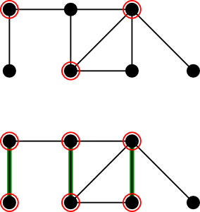

# Algorytmy aproksymacyjne 1: algorytmy kombinatoryczne

Wiele naturalnych problemów algorytmicznych to problemy optymalizacyjne, np:
- **maksymalny przepływ** Dana jest sieć przepływowa. Znaleźć przepływ o maksymalnej wartości.
- **problem plecakowy** Dane jest $n$ przedmiotów o wartościach $v_1,\ldots,v_n$ i rozmiarach $s_1,\ldots,s_n$ oraz rozmiar plecaka $B$. Które przedmioty należy włożyć do plecaka aby miały one sumarycznie największą możliwą wartość?
- **minimalne pokrycie wierzchołkowe** Dany graf nieskierowany $G=(V,E)$. Znaleźć najmniejsze pokrycie wierzchołkowe $G$, tzn. podzbiór wierzchołków $S$, który dotyka każdej krawędzi.
- **problem komiwojażera** Dany pełny graf $n$-wierzchołkowy z nieujemnymi wagami na krawędziach. Znaleźć cykl Hamiltona o najmniejszej wadze (tzn. sumie wag krawędzi).

W problemach tych dla danego egzemplarza problemu (sieć przepływowa, wartości i rozmiary przedmiotów wraz z wielkością plecaka, graf nieskierowany, tablica ${n \choose 2}$ liczb) jest określony pewien zbiór rozwiązań dopuszczalnych (przepływ, wybór przedmiotów mieszczących się w plecaku, pokrycie wierzchołkowe, cykl Hamiltona). Interesuje nas jednak nie dowolne rozwiązanie dopuszczalne ale rozwiązanie w jakimś sensie najlepsze. Dokładniej, na zbiorze rozwiązań dopuszczalnych mamy określoną pewną funkcję celu (o wartościach nieujemnych) i szukamy rozwiązania dopuszczalnego, dla którego wartość funkcji celu (wartość przepływu, sumaryczna wartość przedmiotów w plecaku, liczba wierzchołków w pokryciu, waga cyklu Hamiltona) jest optymalna (maksymalna dla dwóch pierwszych problemów, minimalna dla dwóch pozostałych). Wartość funkcji celu będziemy nazywać krótko *kosztem* rozwiązania (choć słowo to pasuje przede wszystkim do problemów minimalizacyjnych, w przypadku maksymalizacji lepszym słowem byłaby *wartość*).

Z wcześniejszych wykładów wiemy, że problem maksymalnego przepływu można rozwiązać efektywnie, tj. w czasie wielomianowym. Jest to jednak sytuacja dość wyjątkowa: większość naturalnych problemów optymalizacyjnych jest NP-trudnych (dokładniej: NP-trudne są ich wersje decyzyjne). Jest tak np. w przypadku trzech ostatnich problemów z powyższej listy. Zamiast bezradnie rozkładać ręce, możemy jednak spytać co można w takiej sytuacji zrobić. Dotąd rozważaliśmy jedynie rozwiązania szybkie (wielomianowe), optymalne i działające dla dowolnych danych. Możemy pójść na kompromis i ograniczyć jedno (lub więcej) z tych wymagań. Współczesna algorytmika w przeważającej części zajmuje się badaniem efektów takich właśnie kompromisów. W tym wykładzie zajmiemy się prawdopodobnie najszerzej badaną wersją: rezygnujemy jedynie z optymalności rozwiązania. Mimo to, będziemy chcieli kontrolować jakość rozwiązań dopuszczalnych zwracanych przez nasze algorytmy. Będą nas interesowały wyniki typu "algorytm **zawsze** zwraca rozwiązanie gorsze od optymalnego o nie więcej niż 50%". Podamy teraz formalną definicję.

**Definicja**  

Rozważmy wielomianowy algorytm, który dla każdego egzemplarza $I$ pewnego problemu minimalizacyjnego zwraca rozwiązanie dopuszczalne o koszcie ${\rm ALG}(I)$. Niech ${\rm OPT}(I)$ oznacza koszt optymalnego rozwiązania dla egzemplarza $I$. Powiemy, że taki algorytm jest $\alpha$-*aproksymacyjny*,  gdy dla każdego egzemplarza $I$,  

$$
\frac{{\rm ALG}(I)}{{\rm OPT}(I)} \le \alpha.
$$

Dla problemów maksymalizacji definicja jest analogiczna, zmienia się jedynie znak nierówności:

$$
\frac{{\rm ALG}(I)}{{\rm OPT}(I)} \ge \alpha.
$$

Liczba $\alpha$ jest nazywana *współczynnikiem aproksymacji* lub *ilorazem aproksymacji*. Zauważmy w szczególności, że w problemach minimalizacji $\alpha \ge 1$, natomiast w problemach maksymalizacji $\alpha \in [0,1]$. Czasem rozszerzamy powyższą definicję tak, że współczynnik aproksymacji $\alpha$ nie jest stałą tylko pewną funkcją, z reguły zależną od rozmiaru danych: rozważane są np. algorytmy $\log n$-aproksymacyjne czy $\sqrt{n}$-aproksymacyjne.

W dalszych rozważaniach będziemy pisać krótko ${\rm OPT}$ zamiast ${\rm OPT}(I)$, gdyż z reguły będzie jasne z kontekstu o jaki egzemplarz problemu chodzi.

### 2-aproksymacyjny algorytm dla problemu minimalnego pokrycia wierzchołkowego

Podamy teraz bardzo prosty algorytm aproksymacyjny, jednak nawet na tym elementarnym przykładzie widoczne będą pewne cechy obecne w bardziej zaawansowanych algorytmach. Przypomnijmy, że *pokryciem wierzchołkowym* nieskierowanego grafu $G=(V,E)$ nazywamy dowolny zbiór wierzchołków $S \subseteq V$ taki, że dla każdej krawędzi $uv\in E$ zachodzi $\{u,v\} \cap S \neq \emptyset$. Zajmiemy się następującym, klasycznym problemem.

Problem pokrycia wierzchołkowego  

**Dane:** Graf nieskierowany $G=(V,E)$.  

**Problem:** Znaleźć najliczniejsze pokrycie wierzchołkowe grafu $G$.

Nasz algorytm będzie następujący:

Algorytm 2-aproksymacyjny  

1. Znajdź dowolne maksymalne ze względu na zawieranie skojarzenie $M$ w grafie $G$.
2. Zwróć jako rozwiązanie zbiór wierzchołków skojarzonych $V(M)$.

**Przykład: optymalne pokrycie i pokrycie wygenerowane przez algorytm**
Zauważmy, że w punkcie 1. wymagane jest jedynie skojarzenie maksymalne ze względu na zawieranie, a nie najliczniejsze skojarzenie. Takie skojarzenie łatwo jest znaleźć algorytmem zachłannym w czasie liniowym (po prostu dopóki istnieje krawędź, której oba końce nie są skojarzone, dodajemy ją do skojarzenia). Cały algorytm działa więc w czasie liniowym.

**Twierdzenie 1** Powyższy algorytm jest poprawnym 2-aproksymacyjnym algorytmem dla problemu pokrycia wierzchołkowego

*Dowód*  

Oznaczmy przez $C$ zbiór wierzchołków zwracany przez algorytm. Najpierw pokażemy, że $C$ jest pokryciem. Istotnie, gdyby istniała krawędź $uv$ taka, że $\{u,v\}\cap C = \emptyset$, oznaczałoby to, że ani $u$ ani $v$ nie jest skojarzony, a więc $M \cup \{uv\}$ byłoby skojarzeniem zawierającym $M$, a to jest niemożliwe.

Teraz zajmiemy się współczynnikiem aproksymacji. Rozważmy dowolne pokrycie wierzchołkowe $S$. Ponieważ każda krawędź skojarzenia musi mieć koniec w pokryciu, a z definicji skojarzenia te końce są parami różne więc $\vert{}S\vert{} \ge \vert{}M\vert{}$. W szczególności jest to prawda dla pokrycia optymalnego, zatem:  

$$
{\rm OPT} \ge \vert{}M\vert{}.
$$  

Ponieważ $\vert{}C\vert{}=2\vert{}M\vert{}$, więc $\vert{}C\vert{} \le 2 {\rm OPT}$, co kończy dowód. ♦

Zastanówmy się przez chwilę co tak naprawdę wydarzyło się w naszym algorytmie. Pojawia się tam trzech bohaterów: $C$ -- czyli rozwiązanie zwrócone przez algorytm, ${\rm OPT}$ -- rozwiązanie optymalne (tu i w dalszej części wykładu używamy tego samego oznaczenia dla pewnego rozwiązania optymalnego i jego kosztu), oraz $M$ -- skojarzenie maksymalne znalezione przez algorytm. Zastanówmy się jaka jest rola tego ostatniego bohatera, który pojawił się w naszej historii dość niespodziewanie. Skojarzenie $M$ ma dwie kluczowe cechy: możemy je znaleźć w czasie wielomianowym oraz daje oszacowanie dolne na ${\rm OPT}$: w tym przypadku oszacowanie ${\rm OPT} \ge \vert{}M\vert{}$. Otrzymujemy więc obiekt, który w sensie naszej miary kosztu rozwiązania (mocy zbioru) jest *lepszy* niż ${\rm OPT}$ , ale nie jest rozwiązaniem dopuszczalnym. W punkcie 2. algorytmu przekształcamy ten obiekt w rozwiązanie dopuszczalne, tracąc przy tym (dwukrotnie) na koszcie. Skoro nasze rozwiązanie $C$ jest dwukrotnie gorsze niż $M$, a $M$ było lepsze niż   ${\rm OPT}$, to $C$ jest co najwyżej 2 razy gorsze niż ${\rm OPT}$.

Skojarzenie $M$ jest tu swego rodzaju *pośrednikiem* między rozwiązaniem $C$ a  ${\rm OPT}$: umiemy porównać $C$ z $M$ oraz $M$ z  ${\rm OPT}$, razem dostajemy oszacowanie na $C$ względem  ${\rm OPT}$. Często projektując algorytm aproksymacyjny *zaczynamy* od wskazania takiego właśnie pośrednika, a następnie zastanawiamy się, jak z jego pomocą zbudować rozwiązanie dopuszczalne, tracąc możliwie mało na koszcie. Ten schemat pojawi się w kilku kolejnych przykładach.

### Problem komiwojażera i trudność aproksymacji

W poprzednim przykładzie stosunkowo łatwo dostaliśmy algorytm aproksymacyjny ze współczynnikiem aproksymacji ograniczonym przez niewielką stałą (2). Pojawia się naturalne pytanie: czy jest to możliwe dla każdego problemu optymalizacyjnego (powiedzmy, takiego, którego wersja decyzyjna jest w klasie NP)? Oczywiście nie pokażemy tu twierdzenia w rodzaju "dla problemu X nie istnieje algorytm 10-aproksymacyjny", gdyż implikowałoby to, że ${\rm P}\ne {\rm NP}$, a jak wiemy jest to słynny problem otwarty. Podobnie, nie jesteśmy w stanie udowodnić że problem SAT nie posiada algorytmu wielomianowego. Zamiast tego, dowodzi się, że SAT jest NP-trudny. Zrobimy dokładnie tak samo: pokażemy, że aproksymacja pewnego problemu jest NP-trudna (tzn. gdybyśmy potrafili aproksymować, to rozwiązalibyśmy w czasie wielomianowym wszystkie problemy z NP). Rozważymy tu słynny problem komiwojażera.

Problem komiwojażera (Traveling Salesman Problem, TSP)  

**Dane:** Graf pełny nieskierowany $G=(V,E)$ oraz funkcja wagowa $w := E \rightarrow \mathbb{N}$.  

**Problem:** Znaleźć cykl Hamiltona w $G$ o najmniejszej całkowitej wadze (waga cyklu $C$ to $w(C)=\sum_{e\in E(C)}w(e)$).

Przez $n$ będziemy oznaczać liczbę wierzchołków grafu $G$.

**Twierdzenie 2**  

Dla dowolnej funkcji $\alpha : \mathbb{N}\rightarrow \mathbb{N}$ obliczalnej w czasie wielomianowym (np. $\alpha(n)=100$, $\alpha(n)=\log n$, $\alpha(n)=n^5$, $\alpha(n)=2^n$, ale $\alpha(n)=2^{2^n}$ już nie), nie istnieje algorytm $\alpha(n)$-aproksymacyjny dla problemu komiwojażera, o ile  ${\rm P}\ne {\rm NP}$.

*Dowód*  

Załóżmy, że algorytm o którym mowa istnieje (nazwijmy go ,,algorytm $A$''). Pokażemy, że $A$ mógłby zostać użyty do rozwiązania problemu [cyklu Hamiltona](http://wazniak.mimuw.edu.pl/index.php?title=Z%C5%82o%C5%BCono%C5%9B%C4%87_obliczeniowa%2FWyk%C5%82ad_5%3A_Problemy_NP-zupe%C5%82ne) w czasie wielomianowym. W problemie cyklu Hamiltona na wejściu pojawia się graf nieskierowany $G=(V,E)$. Zbudujemy na tej podstawie egzemplarz problemu komiwojażera: będzie to graf pełny $G'$ o zbiorze wierzchołków $V$. Pozostaje określić funkcję $w$:  

$$
w(uv) = \left\{ \begin{array}{ll} 1& \mbox{gdy } uv \in E \\  n\cdot\alpha(n) & \mbox{w p. p. }\end{array} \right.
$$  

Zauważmy, że funkcję $w$ możemy reprezentować w pamięci wielomianowej względem rozmiaru $G$. Na tak określonym egzemplarzu uruchamiamy algorytm $A$.

Wówczas, jeśli $G$ ma cykl Hamiltona to w naszym egzemplarzu problemu komiwojażera ${\rm OPT} = n$, a więc $A$ zwróci rozwiązanie o koszcie co najwyżej $\alpha(n) \cdot n$. Jeśli natomiast $G$ nie zawiera cyklu Hamiltona to każdy cykl Hamiltona w $G'$ zawiera krawędź o wadze $n\cdot\alpha(n)$, a więc cały taki cykl ma wagę większą niż $n\cdot\alpha(n)$, czyli $A$ zwróci rozwiązanie o koszcie większym niż $n\cdot\alpha(n)$.

Powyżej udowodniliśmy, że $G$ ma cykl Hamiltona wtedy i tylko wtedy gdy $A$ zwróci rozwiązanie o koszcie co najwyżej $\alpha(n) \cdot n$, a to możemy sprawdzić w czasie wielomianowym. Ponieważ problem cyklu Hamiltona jest NP-zupełny, więc ${\rm P}= {\rm NP}$, sprzeczność z założeniem.  ♦

### Metryczny problem komiwojażera: 2-aproksymacja

Pokazując trudność problemu komiwojażera, nie zakładaliśmy niczego o funkcji wagowej $w$. Tymczasem w wielu zastosowaniach, w szczególności np. jeśli myślimy o podróżowaniu komiwojażera między "prawdziwymi" miastami na powierzchni ziemi, funkcja $w$ spełnia nierówność trójkąta, tzn. dla dowolnej trójki wierzchołków $a$, $b$, $c$, mamy  

$$
w(ab) \le w(ac) + w(cb).
$$  

Rozważymy teraz wariant problemu komiwojażera, w którym zakładamy, że $w$ spełnia nierówność trójkąta (innymi słowy $w$, określona na parach wierzchołków zamiast na krawędziach, jest [metryką](http://wazniak.mimuw.edu.pl/index.php?title=Analiza_matematyczna_1%2FWyk%C5%82ad_3%3A_Odleg%C5%82o%C5%9B%C4%87_i_ci%C4%85gi)).

Łatwo sprawdzić, że funkcja skonstruowana w dowodzie twierdzenia 2 nie jest metryką, a więc dla takich egzemplarzy nie wykluczyliśmy algorytmów aproksymacyjnych. Okazuje się, że stosunkowo prosto można otrzymać 2-aproksymację. W algorytmie będziemy korzystali z następującego, dobrze znanego, twierdzenia. (Dowód możemy znaleźć np. [w wykładzie z matematyki dyskretnej](http://wazniak.mimuw.edu.pl/index.php?title=Matematyka_dyskretna_1%2FWyk%C5%82ad_13%3A_Grafy_II); czytelnik może sprawdzić, że algorytm wynikający z dowodu można zaimplementować w czasie liniowym.)

**Twierdzenie**  

W spójnym multigrafie istnieje cykl Eulera wtedy i tylko wtedy, gdy stopień każdego wierzchołka jest parzysty. Co więcej, jeśli cykl Eulera istnieje, można go znaleźć w czasie liniowym.

Algorytm 2-aproksymacyjny  

1. Znajdź minimalne drzewo rozpinające $T$ grafu $G$, np. [algorytmem Kruskala](http://pl.wikipedia.org/wiki/Algorytm_Kruskala)
2. Zastąp każdą krawędź $T$ parą krawędzi: otrzymujemy spójny multigraf $T_2$ o parzystych stopniach wierzchołków.
3. Znajdź cykl Eulera $\mathcal{E}=v_1v_2\ldots v_{\vert{}E(T_2)\vert{}}v_1$ w grafie $T_2$.
4. Wypisz wierzchołki grafu $G$ w kolejności ich pierwszych wystąpień w ciągu $v_1,v_2,\ldots,v_{\vert{}E(T_2)\vert{}}$

Przypomnijmy, że algorytm Kruskala w naszym grafie zadziała w czasie $O(\vert{}E(G)\vert{} \log \vert{}E(G)\vert{}) = O(n^2 \log n)$, natomiast cykl Eulera można znaleźć w czasie liniowym. Całkowita złożoność algorytmu wynosi więc $O(n^2 \log n)$, a więc jest wielomianowa.

**Twierdzenie** Powyższy algorytm jest 2-aproksymacyjny.  

*Dowód* W ostatnim kroku algorytmu wypisywana jest pewna permutacja wierzchołków. Ponieważ $G$ jest grafem pełnym, więc ta permutacja wyznacza kolejne wierzchołki pewnego cyklu Hamiltona $C$ w $G$, a więc algorytm zawsze zwraca rozwiązanie dopuszczalne.

Rozważmy dowolne rozwiązanie optymalne OPT. Jest to cykl Hamiltona, a więc w szczególności spójny podgraf rozpinający grafu $G$ (podgraf rozpinający grafu $G$ to taki, który zawiera wszystkie wierzchołki $G$). Nie jest więc lżejszy niż najlżejszy spójny podgraf rozpinający (który musi być drzewem), a więc:

$$
w(T) \le OPT.
$$

Stąd $w(\mathcal{E})=w(T_2)=2w(T) \le 2OPT$. Nasz algorytm dzieli $\mathcal{E}$ na krawędziowo rozłączne marszruty, o końcach w kolejnych wypisywanych w ostatnim kroku wierzchołkach. Każdej takiej marszrucie $v_{i_1}\ldots v_{i_j}$ odpowiada krawędź  $v_{i_1}v_{i_j}$ w zwracanym w ostatnim kroku algorytmu cyklu Hamiltona $C$. Z nierówności trójkąta $w(v_{i_1} v_{i_j}) \le \sum_{k=1}^{j-1}w(v_{i_k} v_{i_{k+1}})$, więc $w(C) \le w(\mathcal{E}) \le 2OPT$.♦

Zauważmy, że w tym algorytmie, podobnie jak to miało miejsce w przypadku pokrycia wierzchołkowego, korzystaliśmy z *pośrednika*: tym razem było to minimalne drzewo rozpinające. Jest to dość naturalny i często używany sposób uzyskiwania pośredników, zwany *relaksacją* (rozluźnieniem). Chodzi o to, że rozluźniamy warunki dotyczące poszukiwanego obiektu tak, aby uzyskać problem wielomianowy. W tym przypadku szukamy najlżejszego cyklu Hamiltona, natomiast cykle Hamiltona są szczególnym przypadkiem spójnych grafów rozpinających oraz najlżejszy spójny podgraf rozpinający możemy znaleźć w czasie wielomianowym. Oczywiście jeśli warunki są rozluźnione, to minimalny (względem naszego kosztu) obiekt w szerszym zbiorze będzie miał koszt mniejszy lub równy kosztowi rozwiązania optymalnego oryginalnego problemu: dostaniemy więc obiekt *lepszy* niż OPT, który następnie (tracąc na koszcie) możemy próbować przekształcić do rozwiązania dopuszczalnego.

### Metryczny problem komiwojażera: (3/2)-aproksymacja

Okazuje się, że zaprezentowany powyżej algorytm 2-aproksymacyjny można stosunkowo łatwo poprawić. Zmodyfikujemy jedynie jeden jego fragment: krok 2. Zauważmy, że celem kroku 2 jest dodanie krawędzi do drzewa rozpinającego $T$ tak, aby otrzymać graf, w którym wszystkie wierzchołki mają parzyste stopnie. Dodatkowo chcemy, żeby waga dodanych krawędzi była niewielka. Poprzednio, podwajaliśmy stopień każdego wierzchołka w $T$. Tym razem spróbujmy być bardziej oszczędni: pozostawmy wierzchołki, które już mają parzysty stopień bez zmian. Niech $N$ będzie zbiorem wierzchołków nieparzystego stopnia w drzewie $T$. Przypomnijmy treść lematu o uściskach dłoni:

$$
\sum_{v\in V}\deg(v) = 2\vert{}E\vert{}.
$$

Stąd, stosując powyższą równość do drzewa $T$, widzimy, że $\vert{}N\vert{}$ jest parzyste. Wystarczy więc połączyć wierzchołki zbioru $N$ w pary, i dla każdej pary dodać do $T$ łączącą je krawędź. Dodatkowo, chcemy to zrobić najtaniej jak się da: innymi słowy, chcemy znaleźć najlżejsze skojarzenie doskonałe (tzn. łączące wszystkie wierzchołki) w podgrafie grafu $G$ indukowanym przez zbiór $N$: taki podgraf oznaczamy przez $G[N]$. Z pomocą przychodzi nam następujące twierdzenie (w [wykładzie o przepływach](http://smurf.mimuw.edu.pl/drupal6/node/1119) udowodniliśmy je w wersji dla grafów dwudzielnych).

**Twierdzenie (Edmonds 1965)**  

Skojarzenie doskonałe o najmniejszym koszcie można znaleźć w czasie wielomianowym.

W takim razie, krok 2. algorytmu zastępujemy przez:

Modyfikacja algorytmu  

2. Znajdź najlżejsze skojarzenie doskonałe $M$ w grafie $G[N]$. Niech $T_2:= T\cup M$.

Pozostaje jeszcze pokazać, że skojarzenie $M$ ma małą wagę *względem wagi rozwiązania optymalnego problemu komiwojażera*.

**Lemat**  

Niech $G=(V,E)$ będzie grafem pełnym z funkcją wagową $w:E\rightarrow\mathbb{R}$ spełniającą nierówność trójkąta. Niech $X$ będzie dowolnym podzbiorem $V$ o parzystej mocy oraz niech $M$ będzie najlżejszym skojarzeniem doskonałym w grafie $G[X]$. Jeśli ${\rm OPT}$ jest najlżejszym cyklem Hamiltona w $G$, to  

$$
w(M) \le \frac{1}{2} w({\rm OPT}).
$$

*Dowód*  

Niech ${\rm OPT}_X$ będzie dowolnym najlżejszym cyklem Hamiltona w $G[X]$. Ponieważ ${\rm OPT}_X$ ma parzystą długość, więc jest sumą dwóch rozłącznych skojarzeń ${\rm OPT}_X = M_1 \cup M_2$. Stąd $w({\rm OPT}_X) = w(M_1) + w(M_2) \ge 2 w(M)$, czyli (*)  

$$
w(M) \le \frac{1}{2}w({\rm OPT}_X).
$$  

Rozważmy teraz cykl Hamiltona $C=e_1\ldots e_{\vert{}X\vert{}}$ w $G[X]$, w którym wierzchołki zbioru $X$ odwiedzane są w takiej samej kolejności jak w cyklu ${\rm OPT}$. Cykl Hamiltona ${\rm OPT}$ możemy podzielić na rozłączne ścieżki ${\rm OPT}=p_1p_2\ldots p_{\vert{}X\vert{}}$ tak, że dla każdego $i=1,\ldots,\vert{}X\vert{}$ ścieżka $p_i$ łączy końce krawędzi $e_i$. Z nierówności trójkąta łatwo pokazać, że $w(e_i) \le w(p_i)$. Stąd,  

$$
w({\rm OPT})=\sum_{i=1}^{\vert{}X\vert{}}w(p_i) \ge \sum_{i=1}^{\vert{}X\vert{}}w(e_i) = w(C) \ge w({\rm OPT}_X),
$$  

gdzie ostatnia nierówność wynika z tego, że ${\rm OPT}_X$ jest najlżejszym cyklem Hamiltona w $G[X]$. Otrzymaliśmy więc $w({\rm OPT}_X)\le w({\rm OPT})$, co razem z (*) daje tezę.  

♦

Na podstawie powyższego lematu otrzymujemy, że $w(T_2) = w(T) + w(M) \le w({\rm OPT}) + \frac{1}{2}w({\rm OPT}) = \frac{3}{2}w({\rm OPT})$. Jeśli dokończymy analizę tak jak w przypadku algorytmu 2-aproksymacyjnego, dostaniemy poniższe twierdzenie.

**Twierdzenie (Christofides 1976)**  

Istnieje algorytm (3/2)-aproksymacyjny dla metrycznego problemu komiwojażera.

Warto zaznaczyć, że do dziś (2011r) nie jest znany algorytm o mniejszym współczynniku aproksymacji i stworzenie takiego algorytmu jest jednym z najważniejszych problemów otwartych w dziedzinie algorytmów aproksymacyjnych. W 2010r. udało się uzyskać lepsze algorytmy (aktualny rekord to 13/9=1,(4)) dla szczególnego przypadku, gdy $w$ jest metryką najkrótszych ścieżek w nieskierowanym grafie bez wag.
