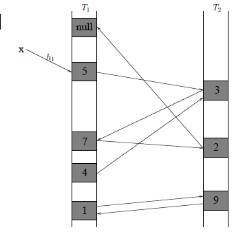
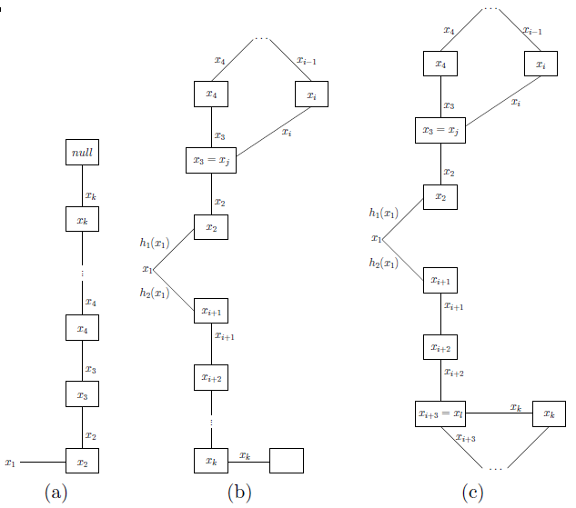

# Haszowanie 2: haszowanie doskonałe i kukułkowe

## Oczekiwana liczba kolizji w haszowaniu uniwersalnym

Niech $S \subseteq U$ będzie ustalonym zbiorem oraz niech $h : U \rightarrow \{0,\ldots,m-1\}$ będzie rodziną wybraną losowo z pewnej rodziny uniwersalnej. Przypomnijmy, że kolizją nazywamy parę $x,y \in S$ taką, że $h(x)=h(y)$. Oczywiście im większe wybierzemy $m$, tym (średnio) kolizji będzie mniej. Spróbujmy ustalić tę zależność.

$$
\mathbb{E}[\text{całkowita liczba kolizji}] = \mathbb{E}[\sum_{x,y \in S} \mathbf{1}_{h(x) = h(y)}] =\sum_{x,y \in S} \mathbb{E}[\mathbf{1}_{h(x) = h(y)}] = \sum_{x,y \in S} \mathbb{P}[h(x) = h(y)] \leq {n\choose 2} \frac{1}m < \frac{n^2}{2m}
$$

Z nierówności Markowa otrzymujemy:  

$$
\mathbb{P}[\text{całkowita liczba kolizji} \geq \frac{n^2}m] < \frac{1}2 .
$$

**Wniosek 1**  

 Dla $m=n^2$, z prawdopodobieństwem co najmniej $\frac{1}{2}$, w ogóle nie będzie kolizji .

**Wniosek 2**  

 Dla $m=n$, z prawdopodobieństwem co najmniej $\frac{1}{2}$, całkowita liczba kolizji będzie mniejsza $n$.

## Statyczny słownik w pamięci $O(n^2)$

W wielu zastosowaniach korzystamy ze słownika w następujący sposób: najpierw budujemy słownik dla danego zbioru $S$, a następnie słownik nie jest już modyfikowany, chcemy jedynie wyszukiwać w nim elementy. Prowadzi to do problemu statycznego słownika, w którym chcemy zaimplementować dwie operacje:

- Build($S$) -- buduje strukturę danych reprezentującą zbiór $S$,
- Lookup($x$) -- czy $x \in S$?

Niech $\vert{}S\vert{}=n$. Na podstawie wniosku 1, jeśli dysponujemy pamięcią $O(n^2)$, możemy zbudować bardzo efektywny statyczny słownik. Mianowicie, przyjmujemy $m = n^2$. Operacja Build wygląda nastepująco. Inicjalizujemy tablicę haszującą $T[0,\ldots,m-1]$ wartościami NULL. Losujemy funkcję haszującą $h$ z rodziny uniwersalnej. Następnie, dla każdego $x\in S$, jeśli $T[h(x)] = NULL$ to wpisujemy $T[h(x)] := x$, w przeciwnym przypadku dostaliśmy kolizję: usuwamy z tablicy $T$ wstawione elementy i próbujemy ponownie (losujemy $h$, wstawiamy elementy $S$ do $T$), aż do skutku. W efekcie otrzymujemy funkcję haszującą $h$, która nie ma żadnych kolizji na zbiorze $S$, czyli Lookup($x$) działa w czasie **pesymistycznym** stałym: po prostu sprawdza, czy $T[h(x)]=x$.

Pozostaje odpowiedzieć na pytanie, w jakim czasie działa Build. Każda faza operacji Build (wylosowanie $h$ i sprawdzenie czy są kolizje) zajmuje czas pesymistyczny $O(n)$. Jaka jest oczekiwana liczba faz? Jest to zmienna losowa o rozkładzie geometrycznym z prawdopodobieństwem sukcesu $p \ge \frac{1}{2}$, gdzie oszacowanie $p$ wynika z punktu wniosku 1. Wartość oczekiwana takiej zmiennej wynosi $\frac{1}{p} \le 2$. Stąd, średnio wykonają się co najwyżej 2 fazy, więc oczekiwany czas operacji Build jest rzędu $O(n)$, jeśli nie liczyć inicjalizacji, która niestety podnosi całkowity (oczekiwany) czas do $O(n^2)$.

Opisana struktura danych składa się z dwóch elementów: tablicy $T$, która zajmuje pamięć rzędu $O(n^2)$ oraz reprezentacji funkcji haszującej $h$, która zajmuje pamięć stałą jeśli korzystamy z jednej z rodzin uniwersalnych opisanych w poprzednim wykładzie.

**Wniosek 3**  

Można zaimplementować statyczny słownik w pamięci $O(n^2)$ tak, że Build działa w oczekiwanym czasie $O(n^2)$, natomiast operacja Lookup jest wykonywana w pesymistycznym czasie stałym.

## Haszowanie doskonałe

W 1984 roku Fredman, Komlos i Szemeredi pokazali, że dla statycznego słownika pesymistyczny czas stały zapytań można uzyskać nawet przy liniowej pamięci. Jedyną ceną będzie randomizacja, czas budowy struktury jest liniowy, ale w sensie wartości oczekiwanej. W tym rozdziale opisujemy ten piękny rezultat, zwany haszowaniem doskonałym.

Niech $\mathcal{H}$ będzie uniwersalną rodziną funkcji haszujących postaci $h:U \rightarrow \{0,\ldots,n-1\}$.  Pseudokod operacji Build można przedstawić następująco:

1. Losuj $h$ z rodziny $\mathcal{H}$ dopóki całkowita liczba kolizji w zbiorze $S$ jest mniejsza niż $n$.
2. Dla każdego $i=0,\ldots,n-1$:
  1. Niech $S_i=\{x\in S\ \vert{}\ h(x)=i\}$.
  2. Zbuduj statyczny słownik $T_i$ dla zbioru $S_i$ algorytmem z poprzedniego rozdziału. Adres słownika $T_i$ przechowujemy w komórce $T[i]$ tablicy $T$ o długości $n$.

Operacja Lookup($x$) sprowadza się do wykonania Lookup($x$) w słowniku $T_{h(x)}$, a więc zadziała w pesymistycznym czasie stałym.

Na rozmiar struktury składa się tablica $T$ rozmiaru $O(n)$, reprezentacja funkcji haszującej $h$ rozmiaru $O(1)$ oraz słowniki $T_i$ o łącznym rozmiarze $O(\sum_{i=0}^{n-1} \vert{}S_i\vert{}^2)$. Tę wielkość można oszacować następująco:  

$$
\sum_{i=0}^{n-1} \vert{}S_i\vert{}^2 = 2\sum_{i=0}^{n-1} {\vert{}S_i\vert{} \choose 2} + n \leq 3n,
$$  

ponieważ $\sum_{i=0}^{n-1} {\vert{}S_i\vert{} \choose 2}$ jest całkowitą liczbą kolizji elementów z $S$ przy użyciu funkcji $h$, a pamiętamy, że $h$ została wybrana w taki sposób, że liczba kolizji nie przekracza $n$. Całkowity rozmiar jest zatem rzędu $O(n)$.

Podobnie jak w poprzednim rozdziale, liczba losowań w punkcie 1 algorytmu ma rozkład geometryczny z prawdopodobieństwem sukcesu co najmniej 1/2 (tym razem korzystamy z wniosku 2), a więc oczekiwana liczba prób nie przekracza 2. Ponieważ sprawdzenie liczby kolizji można wykonać w czasie $O(n)$, więc punkt 1. wykona się w oczekiwanym czasie $O(n)$.

Ponieważ dla każdego $i$ słownik $T_i$ jest budowany w oczekiwanym czasie $O(\vert{}S_i\vert{}^2)$ więc z liniowości wartości oczekiwanej, punkt 2. wykona się w oczekiwanym czasie $O(\sum_{i=0}^{n-1} \vert{}S_i\vert{}^2)$, a tę wielkość oszacowaliśmy już przez $O(n)$.

Możemy podsumować nasze rozważania w formie twierdzenia.

**Twierdzenie (Fredman, Komlos, Szemeredi)**  

Dla danego $n$-elementowego zbioru $S$ można w oczekiwanym czasie $O(n)$ zbudować statyczny słownik o rozmiarze $O(n)$, w którym wyszukiwanie elementu zajmuje pesymistyczny czas stały. ♦

## Haszowanie kukułkowe

Tym razem rozwiązujemy pełny problem słownika, czyli będziemy implementować wszystkie trzy operacje -- Lookup, Insert i Delete. Celem jest słownik, w którym operacja Lookup (w wielu zastosowaniach wykonywana znacznie częściej niż Insert i Delete) działa w pesymistycznym czasie stałym, natomiast Insert w oczekiwanym czasie stałym. Przedstawimy ciekawe rozwiązanie tego problemu, nazywane haszowaniem kukułkowym, zaproponowane w 2001r przez Pagha i Rodlera. Inspiracją dla tej metody było ciekawe zjawisko *siły podwójnego wyboru* znane w teorii schematów urnowych. Jeśli wrzucimy losowo $n$ kul do $n$ urn, to z prawdopodobieństwem co najmniej $1-\frac{1}{n}$ najbardziej zapełniona urna będzie miała $\Theta(\log n / \log\log n)$ kul. Wyobraźmy sobie jednak nieco zmodyfikowany proces: dla każdej kuli wybieramy losowo *dwie* urny i kulę umieszczamy w mniej zapełnionej urnie. Wówczas można udowodnić, że z prawdopodobieństwem co najmniej $1-\frac{1}{n}$ najbardziej zapełniona urna będzie miała $\Theta(\log\log n)$ kul. Widzimy, że wprowadzenie wyboru między dwiema lokacjami dla kuli spowodowało wykładniczą poprawę.

W haszowaniu kukułkowym używamy następującej analogii z powyższym schematem urnowym: każdy element $x\in U$ ma *dwa* miejsca w strukturze danych, w których może się znajdować. Dokładniej, używamy dwóch funkcji haszujących $h_1,h_2: U \rightarrow \{0,\ldots,m-1\}$ oraz dwóch tablic $T_1,T_2[0, \ldots, m-1]$, dla pewnego $m\ge 2n$. Chwilowo, dla uproszczenia załóżmy, że $h_1$ i $h_2$ zostały wybrane losowo z rodziny $n$-niezależnej (pod koniec wykładu osłabimy to założenie). W komórkach tablic $T_1$ i $T_2$ przechowujemy pojedyncze klucze (elementy $S$). W trakcie działania algorytmu będzie zachodził następujący niezmiennik:  

$$  

x \in S \iff T_1[h_1(x)] =x \vee T_2[h_2(x)] = x.  

$$  

Implementacja operacji Lookup jest w tym momencie jasna. Podobnie Delete($x$), usuwa $x$ z $T_1[h_1(x)]$ lub $T_2[h_2(x)]$. Jest oczywiste, że obie te operacje działają w pesymistycznym czasie stałym. W dalszej części zajmujemy się operacją Insert.

```
procedure Insert (x)
  if (T2 [h1[x]] = x) or (T2 [h2[x]] = x) then Exit;
 
  for i := 1 to MAX_LOOP do
    x :=: T1[h1[x]];  {zamiana wartości x i T1[h1[x]]}
    if x = NULL then Exit; 
    x :=: T2[h2[x]];  {zamiana wartości x i T2[h2[x]]}
    if x = NULL then Exit; 
  end;
 
  rehash (x);
end
```

  

Operacja `:=:` zamienia wartości zmiennych, tzn.  `x:=:y` odpowiada trzem operacjom: `a:=x; x:=y; y:=a;`. Przykład działania operacji Insert($x$) możemy prześledzić na rysunku obok. Chcemy wstawić $x$ w $T_1[h_1(x)]$. Niestety jest tam już element 5. Wówczas podmieniamy 5 na $x$ w komórce $T_1[h_1(x)]$, podobnie jak kukułka podmienia w gnieździe innego ptaka jedno z jego jajek na swoje jajko. Kukułka nie przejmuje się wyrzuconym jajkiem, my jednak próbujemy wstawić 5 w inne miejsce struktury danych. Alternatywną lokacją jest $T_2[h_2(5)]$. Umieszczamy tam 5, ale wcześniej była tam 3, więc teraz wstawiamy 3. Alternatywną lokacją jest  $T_1[h_1(3)]$, gdzie mamy element 7. Z kolei 7 umieszczamy w $T_2[h_2(7)]$, usuwając stamtąd 2. Wreszcie, okazuje się, że alternatywna lokacja dla 2 jest wolna: możemy wstawić 2 w $T_1[h_1(2)]$ i zakończyć wykonanie procedury.

Podczas wstawiania elementu algorytm ,,wędruje'' po strukturze danych wzdłuż pewnej ścieżki (tak naprawdę marszruty, gdyż może powtórnie odwiedzić tę samą komórkę tablicy). W dalszej części wykładu pokażemy, że wartość oczekiwana długości tej marszruty jest niewielka (stała). Z pewnym małym prawdopodobieństwem może się jednak zdarzyć tak, że algorytm ulegnie zapętleniu: będzie odwiedzał klucze z pewnego zbioru $A\subseteq S$, podczas gdy liczba możliwych miejsc, w których te elementy mogą się znajdować będzie zbyt mała, tzn. $\vert{}h_1(A)\vert{} + \vert{}h_2(A)\vert{} < \vert{}A\vert{}$. Jeśli wykonanych zostanie zbyt wiele kroków (więcej od `MAX_LOOP` -- pokażemy później, że wystarczy przyjąć   `MAX_LOOP`$=O(\log n)$, a na razie załóżmy, że `MAX_LOOP`$\le n$), funkcja Insert **poddaje się**, tzn. uznaje, że najprawdopodobniej nastąpiło zapętlenie. W takiej sytuacji wykonywana jest operacja rehash$(x)$, która działa następująco. Tablice $T_1$ i $T_2$ są czyszczone, losowane są nowe funkcje $h_1$ i $h_2$ i przy ich pomocy wszystkie elementy $S\cup\{x\}$ wstawiane są na nowo do tablic za pomocą algorytmu Insert. Oczywiście nawet po wylosowaniu nowych $h_1$ i $h_2$ z pewnym prawdopodobieństwem jedno ze wstawień może się poddać -- wtedy ponownie losowane są nowe funkcje $h_1$ i $h_2$ i tak  aż do skutku. W takiej sytuacji pojedyncze wykonanie Insert będzie bardzo kosztowne: jedna próba wylosowania nowych funkcji haszujących i rozmieszczenia zbioru $S$ w $T_1$ i $T_2$ zgodnie z tymi funkcjami zajmuje czas $\Omega(n)$. Okaże się jednak, że taka sytuacja zdarza się tak rzadko, że całkowity oczekiwany czas Insert i tak jest $O(1)$.

### Oszacowanie oczekiwanego czasu działania Insert

Niech $G$ będzie grafem dwudzielnym, którego wierzchołkami są komórki tablic $T_1,T_2$, oraz dla każdego $x\in S$ graf $G$ zawiera krawędź $h_1(x)h_2(x)$. Zauważmy, że działanie funkcji Insert wyznacza pewną marszrutę w tym grafie. Niech $x_1,\ldots,x_k$ będą kolejnymi kluczami, które ,,odwiedza'' ta marszruta. Marszruta ta może zawierać cykle, nie może być jednak zupełnie dowolna.

Mianowicie, zobaczmy co się dzieje gdy marszruta po raz pierwszy powraca do wierzchołka, w którym już była, tzn.  pewien klucz $x_i$ jest wstawiany w miejsce klucza $x_j$, dla pewnego $j< i$. Wówczas $x_j$ jest wstawiany w miejsce $x_{j-1}$, $x_{j-1}$ w miejsce $x_{j-2}$ itd, czyli cofamy się wzdłuż marszruty aż do komórki $T_1[h_1(x_1)]$. Następnie odwiedzana jest komórka $T_2[h_2(x_1)]$. Od tej chwili marszruta ponownie może odwiedzać nowe klucze. Jeśli w pewnej chwili natrafi na pustą komórkę, operacja Insert się zakończy. W takiej sytuacji powiemy, że mamy do czynienia z *pojedynczym cyklem* (patrz rysunek 1b). Jeśli natomiast marszruta ponownie natrafi na wcześniej odwiedzoną komórkę $x_l$, to tak generowana marszruta bez końca będzie już poruszać się po krawędziach odpowiadających odwiedzonym kluczom (a dokładniej poruszałaby się bez końca, gdyby nie sztywne ograniczenie 2`MAX_LOOP` na liczbę wykonanych kroków, patrz rysunek c). Taką marszrutę nazwiemy *podwójnym cyklem*.

Rysunek 1: Trzy możliwe sytuacje podczas wstawiania: a) ścieżka, b) pojedynczy cykl, c) podwójny cykl  



**Lemat 4**  

Prawdopodobieństwo, że marszruta nie jest podwójnym cyklem oraz jej długość wynosi co najmniej $k$ nie przekracza $\left( \frac{1}2\right)^{k/3-2}$.

*Dowód*  

Niech $A$ oznacza zdarzenie, którego prawdopodobieństow chcemy oszacować.  

Zdarzenie $A$  implikuje, że zaszła jedna z dwóch sytuacji:

- w ogóle nie było cyklu; każdy wierzchołek był odwiedzany raz
- był tylko pojedynczy cykl

Jeśli dana marszruta ma długość $k$, to istnieje podmarszruta o początku w $T_1[h_1(x_1)]$ lub $T_2[h_2(x_1)]$ o długości $k/3$, która jest ścieżką. Oznaczmy przez $x'_1,\ldots,x'_{k/3}$ jej kolejne klucze (jest to spójny podciąg ciągu $x_1,\ldots,x_k$). Oszacujemy prawdopodobieństwo zdarzenia, że taka marszruta faktycznie pojawia się w grafie losowym stworzonym na podstawie $h_1$ i $h_2$:

$$
\begin{align}  

& \mathbb{P}[A] \le \\  

& 2\cdot\mathbb{P}[\text{istnieje $k/3$ parami różnych }x_2,\ldots,x_{k/3} \text{ t.ż.} h_1(x_1) = h_1(x_2) \wedge h_2(x_2)=h_2(x_3)  \wedge h_1(x_3) = h_1(x_4) \wedge \ldots] \le\\  

& 2 \cdot n^{k/3-1} \cdot \left( \frac{1}m\right)^{k/3-1} = 2 \cdot \left( \frac{n}m\right)^{k/3-1} \leq \left( \frac{1}2\right)^{k/3-2}.  

\end{align}
$$  

 ♦

Pokażemy teraz, że prawdopodobieństwo wystąpienia niekorzystnej sytuacji podwójnego cyklu jest bardzo małe.

**Lemat 5**  

Prawdopodobieństwo, że wygenerowana przy operacji Insert marszruta jest podwójnym cyklem nie przekracza $O(1/n^2)$.

*Dowód*  

Niech $x_i$, $x_j$ i $x_l$ będą takie jak w definicji podwójnego cyklu powyżej.

Dla ustalonego klucza początkowego $x_1$, oszacujmy liczbę możliwych cykli podwójnych odwiedzających $k$ kluczy:

- na co najwyżej $n^{k-1}$ sposobów wybieramy pozostałe klucze
- na $k^3$ sposobów wybieramy kształt cyklu (czyli indeksy $i,j,l$)
- na $m^{k-1}$ sposobów wybieramy wierzchołki grafu, na których będzie leżał cykl ($k-1$, bo dla jednego klucza nie ma miejsca)

Razem co najwyżej $n^{k-1} \cdot k^3 \cdot m^{k-1}$ cykli.

Każdy taki cykl składa się z $k$ krawędzi, z których każda pojawia się niezależnie z prawdopodobieństwem $\left(\frac{1}{m}\right)^2$, na mocy niezależności losowania $h_1$ i $h_2$ oraz faktu, że $h_1$ i $h_2$ mają rozkład jednostajny. Z $n$-niezależności rodziny funkcji haszujących, z których wybierane są $h_1$ i $h_2$, mamy, że prawdopodobieństwo pojawienia się takiego cyklu nie przekracza  $\left(\frac{1}{m}\right)^{2k}$ (zauważmy, że potrzebowaliśmy jedynie $k$-niezależności, a $k\le 2$`MAX_LOOP`. Stąd

$$
\mathbb{P}[\text{marszruta jest cyklem podwójnym o $k$ kluczach}]\leq n^{k-1} \cdot k^3 \cdot m^{k-1} \cdot \frac{1}{m^{2k}}.
$$

Tak więc  

$$
\mathbb{P}[\text{marszruta jest cyklem podówójnym}] \leq \sum_{k \geq 3} \frac{n^{k-1} \cdot k^3 \cdot m^{k-1}}{m^{2k}} \leq \sum_{k \geq 3} k^3 \cdot \frac{n^{k-1}}{m^{k+1}} \leq \frac{1}{m^2}\sum_{k \geq 3} k^3 \cdot \frac{1}{2^{k-1}} =O\left(\frac{1}{m^2}\right) = O\left(\frac{1}{n^2}\right)
$$  

♦

Widzimy, że operacja wstawienia poddała się, gdy wystąpiła jedno ze zdarzeń:

- był podwójny cykl -- z lematu 6 prawdopodobieństwem $O(1/{n^2})$
- była długa marszruta -- z lematu 4 z prawdopodobieństwem $O\left(\left(\frac{1}{2}\right)^{\frac{MaxLoop}{3}}\right)$,

Ponieważ przyjęliśmy `MAX_LOOP`$= 6 \lg n$, otrzymujemy następujący wniosek.

**Wniosek 6**  

Prawdopodobieństwo, że operacja wstawienia podda się nie przekracza $O(1/{n^2})$. ♦

**Twierdzenie**  

Oczekiwany czas operacji Insert jest ograniczony przez stałą.

*Dowód*  

Obliczmy oczekiwany czas operacji rehash. Wykonuje ona $n$ wstawień. Wówczas, na mocy wniosku 7,  

$\mathbb{P}[\text{pewne wstawienia się poddało}] \le n \mathbb{P}[\text{konkretne wstawienie się poddało}] = O(1/n)$.  

Zatem liczba powtórzeń zanim wszystkie operacje Insert się powiodą ma rozkład geometryczny z prawdopodobieństwem sukcesu $1-O(1/n)$, stąd jej wartość oczekiwana to $(1-O(1/n))^{-1} = 1+O(1/n)$. Na jedną taką próbę składa się wylosowanie funkcji haszujących $h_1$ i $h_2$ oraz wstawienie co najwyżej $n$ kluczy. Każde wstawienie zajmuje czas $O(\mathtt{MAX\_LOOP})=O(\log n)$. Stąd, pesymistyczny czas pojedynczej próby będzie $O(n\log n)$ przy założeniu, że losowanie funkcji nie trwa zbyt długo. Ponieważ oczekiwaną liczbę prób oszacowaliśmy przez $1+O(1/n)$, więc ostatecznie oczekiwany czas rehash (czyli wszystkich prób) nie przekracza $O(n \log n)$.  

Stąd,

$$
\mathbb{E}[\text{czas Insert $+$ czas rehash  \vert{} Insert poddał się}] = O(\log n)
$$

Teraz zajmijmy się przypadkiem, gdy Insert nie poddał się.

Zauważmy, że

$$
\mathbb{P}[\text{marszruta ma długość $\ge k$ \vert{} Insert nie poddał się}] = \frac{\mathbb{P}[\text{marszruta ma długość $\ge k$ i Insert nie poddał się}]}{\mathbb{P}[\text{Insert nie poddał się}]}
$$

Ponieważ jeśli insert nie poddał się, to nie było podwójnego cyklu oraz z Lematu 4 i Wniosku 6 mamy

$$
\mathbb{P}[\text{marszruta ma długość $\ge k$ \vert{} Insert nie poddał się}] \le \mathbb{P}[\text{marszruta ma długość $\ge k$ i nie nie ma podwójnego cyklu}] \le \frac{(\frac{1}2)^{k/3-2}}{1-O(n^{-2})}
$$

Stąd,

$$
\begin{align*}  

&\mathbb{E}[\text{czas Insert \vert{} Insert nie poddał się}] = \sum_k \mathbb{P}[\text{marszruta ma długość $\ge k$ \vert{} Insert nie poddał się}] = O (\sum_k (\frac{1}2)^{k/3-2}) = O(1).  

\end{align*}
$$

Razem otrzymujemy

$$
\begin{align*}  

&\mathbb{E}[\text{czas Insert}] \\  

={}&\mathbb{E}[\text{czas Insert \vert{} Insert nie poddał się}]\cdot \mathbb{P}[\mbox{Insert nie poddał się}] +\mathbb{E}[\text{czas Insert $+$ czas rehash  \vert{} Insert poddał się}]\cdot \mathbb{P}[\text{Insert poddał się}] \\  

={}& O(1) (1-O(1/n^2))+ O(n \log n)O(1/n^2) = O(1).  

\end{align*}
$$  

♦

Zauważmy na koniec, że powyższa analiza jest poprawna również wówczas, gdy funkcje $h_1$ i $h_2$ są losowane z rodziny 2`MAX_LOOP`-niezależnej, bo rozpatrujemy tylko ścieżki maksymalnie tej długości, a pamiętamy, że `MAX_LOOP` jest rzędu $O(\log n)$. Istnieją rodziny funkcji haszujących które oferują taką niezależność, zachowując równocześnie stały czas obliczania wartości funkcji, a także czas losowania i rozmiar rzędu $O(n)$, jednakże mają one znaczenie tylko teoretyczne. Z drugiej strony, haszowanie kukułkowe w praktyce zachowuje się dobrze dla rodzin funkcji haszujących o dużo słabszych własnościach. Jest problem otwartym, czy oczekiwany czas operacji wstawiania pozostanie stały jeśli zastosujemy rodzinę funkcji tabulacyjnych opisane w poprzednim wykładzie (jak pamiętamy nie jest ona nawet 4-niezależna, taki wynik wymagałby więc zupełnie innej analizy niż przeprowadzona powyżej).
