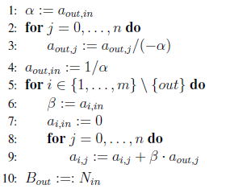

# Programowanie liniowe 2: Algorytm simplex i informacja o algorytmach wielomianowych

## Algorytmy programowania liniowego

Pierwszym algorytmem programowania liniowego był algorytm simplex, opublikowany przez George'a Dantziga w 1947 roku. Algorytm ten najpierw znajduje pewien wierzchołek wielościanu rozwiązań dopuszczalnych, a następnie w pętli przemieszcza się wzdłuż krawędzi do jednego z sąsiednich wierzchołków tak, aby poprawić wartość funkcji celu. Niestety okazuje się, że jego pesymistyczna złożoność jest wykładnicza. Doskonale zachowuje się on jednak dla ,,rzeczywistych'' danych i jest powszechnie stosowany w praktyce.

Kolejny przełom nastąpił w 1979 kiedy to Leonid Khachiyan opublikował tzw. metodę elipsoidalną, czyli algorytm wielomianowy o złożoności $O(n^4L)$, gdzie $L$ jest ograniczone z góry przez długość zapisu binarnego danych (macierzy $\mathbf{A}$, wektorów $\mathbf{b}$ i $\mathbf{c}$). Istnieją implementacje tego algorytmu, jednakże źle sprawdzają się w praktyce.

W 1984 roku zupełnie inne podejście zaproponował Narendra Karmarkar. Jego metoda punktu wewnętrznego osiąga złożoność $O(n^{3.5}L)$ i została poprawiona przez kolejnych autorów do $O(n^3L)$. Podobno niektóre implementacje tego algorytmu zachowują się bardzo dobrze dla rzeczywistych danych (porównywalnie albo lepiej niż algorytm simplex). Mimo to, nawet ten algorytm jest rzadko stosowany praktyce.

## Algorytm simplex

W poprzednim rozdziale zauważyliśmy już, że poszukując rozwiązań optymalnych można ograniczyć się do wierzchołków wielościanu. Algorytm simplex korzysta z tej obserwacji i realizuje podejście *local search*. Dokładniej, algorytm zaczyna od dowolnego wierzchołka wielościanu i w każdej kolejnej iteracji próbuje przemieścić się do takiego sąsiedniego wierzchołka, że wartość funkcji celu poprawia się (lub przynajmniej nie pogarsza).

Opiszemy teraz algorytm simplex na przykładzie konkretnego programu liniowego:

$$
\begin{array}{lr}  

       \textrm{max}                    & 3x_1 + x_2 +2x_3 \\  

                                       & x_1 + x_2 + 3x_3 \le 30 \\  

                                       & 2x_1 + 2x_2 + 5x_3 \le 24\\  

                                       & 4x_1 + x_2 + 2 x_3 \le 36\\  

                                       & x_1, x_2, x_3 \ge 0.  

       \end{array}
$$

Zauważmy, że jest to program w postaci standardowej (w wersji maksymalizacyjnej), oraz wszystkie wyrazy wolne z prawych stron nierówności są nieujemne. Dzięki temu łatwo znaleźć dla niego rozwiązanie dopuszczalne --- rozwiązanie zerowe: $x_1=0$, $x_2=0$, $x_3=0$.

Zapiszmy teraz ten program w postaci dopełnieniowej, wprowadzając zmienną dopełnieniową dla każdej nierówności (z wyłączeniem warunków nieujemnościowych). Dodatkowo funkcję celu zastąpmy nową zmienną $z$:

$$
\begin{array}{rl}  

       \textrm{max}                    & z \\  

                                      z & = 3x_1 + x_2 +2x_3\\  

                                      x_4 &  = 30 - x_1 - x_2 - 3x_3 \\  

                                      x_5 &  = 24 - 2x_1 - 2x_2 - 5x_3\\  

                                      x_6 &  = 36 - 4x_1 - x_2 - 2 x_3\\  

                                       & x_1, x_2, x_3, x_4, x_5, x_6 \ge 0.  

       \end{array}
$$

Nasze rozwiązanie dopuszczalne, rozszerzone o zmienne dopełnieniowe ma teraz następującą postać:  

$$
x_1 = 0, x_2 = 0, x_3 = 0, \quad x_4 = 30, x_5 = 24, x_6 = 36.
$$

Podczas działania algorytmu, w kolejnych krokach będziemy zmieniać nasz *program liniowy*. Mimo, iż ograniczenia będą się zmieniać, zawsze będą one opisywać ten sam wielościan (tzn. zbiór rozwiązań dopuszczalnych). W każdym kroku nasz program liniowy będzie miał szczególną postać, która w sposób jednoznaczny będzie wyznaczać pewien wierzchołek wielościanu --- najlepsze dotąd znalezione rozwiązanie. Podamy teraz niezmiennik, który opisuje postać tych programów.

Niezmiennik sformułujemy dla dowolnego programu (a nie tylko powyższego przykładu). Załóżmy, że początkowy program w postaci dopełnieniowej ma $m$ równości, oraz zawiera zmienne $x_1,\ldots, x_{n+m}$ (gdzie $x_{n+1},\ldots, x_{n+m}$ są zmiennymi dopełnieniowymi).

Niezmiennik 1  

Zbiór zmiennych $\{x_1,\ldots,x_{n+m}\}$ dzieli się na dwa rozłączne zbiory: $m$ zmiennych *bazowych* i $n$ zmiennych *niebazowych*. Oznaczmy zbiór indeksów zmiennych bazowych przez $B=\{B_1,\ldots,B_m\}$ (baza) i zmiennych niebazowych przez $N=\{N_1,\ldots,N_n\}$. Program zawiera:

- równanie postaci $z = v + \sum_{j=1}^n c_j x_{N_j}$;
- dla każdego $i=1,\ldots,m$ równanie postaci $x_{B_i} = b_i + \sum_{j=1}^{n}a_{i,j} x_{N_j}$, gdzie $b_i\ge 0$;
- dla każdego $i=1,\ldots,n+m$ nierówność $x_i\ge 0$,

gdzie $v$, $c_j$, $b_j$, $a_{i,j}$ są stałymi.

W rozważanym przez nas przykładzie, powyższy niezmiennik jest spełniony dla $N=\{1,2,3\}$ oraz $B=\{4,5,6\}$.

**Fakt**  

 Jeśli spełniony jest niezmiennik 1, to rozwiązanie $(x_1,\ldots,x_{n+m})$ postaci  

 $$
x_i = \left\{ \begin{array}{cl}  

                  0 & \text{gdy $i\in N$} \\  

                  b_j & \text{gdy $i=B_j$ dla pewnego $j=1,\ldots,n$}  

                 \end{array} \right.
$$  

 jest bazowym rozwiązaniem dopuszczalnym o wartości funkcji celu $v$.

*Dowód*  

 Łatwo sprawdzić, że tak zdefiniowane rozwiązanie jest rozwiązaniem dopuszczalnym o wartości funkcji celu $v$.  Aby pokazać, że jest to bazowe rozwiązanie dopuszczalne musimy wskazać $n+m$ liniowo niezależnych ograniczeń spełnionych z równością. W tym celu, dla każdego $i\in B$ wybieramy (jedyną) równość zawierającą $x_i$ oraz dla każdego $i\in N$ nierówność $x_i\ge 0$. ♦

Z powyższego faktu wynika, że o ile spełniony jest niezmiennik, to faktycznie znajdujemy się w wierzchołku aktualnego programu w postaci dopełnieniowej. Łatwo sprawdzić też, że po zignorowaniu zmiennych dopełnieniowych otrzymamy wierzchołek odpowiadającego programu w postaci standardowej, a więc faktycznie algorytm będzie generował wierzchołki wielościanu oryginalnego programu liniowego.

Wróćmy do algorytmu simplex. Naszym celem jest zwiększenie zmiennej $z$. W tym celu spójrzmy na dowolną zmienną niebazową z dodatnim współczynnikiem w funkcji celu. W tym przypadku możemy wybrać dowolną zmienną z $x_1, x_2, x_3$ --- wybierzmy $x_1$.  

Oczywiście powiększając $x_1$ powiększamy $z$. Jak bardzo możemy powiększyć $x_1$, zachowując wszystkie ograniczenia? Dopóki zmienne bazowe pozostają nieujemne, a więc:  

$$
x_1 := \min \left\{\frac{30}{1}, \frac{24}{2}, \frac{36}{4}\right\} = \frac{36}{4} = 9.
$$  

Po takiej operacji przynajmniej jedna zmienna bazowa (w tym przypadku $x_6$) przyjmuje wartość $0$. To pozwala na zmianę bazy (a w konsekwencji zmianę wierzchołka, w którym jesteśmy): zmienna $x_1$ wchodzi do bazy (jest *zmienną wchodzącą*), a zmienna $x_6$ wychodzi z bazy (*zmienna wychodząca*). Operacja wymiany bazy (ang. {\mathbf{b}f pivot}) przebiega w dwóch krokach:

1. Rozwiąż równanie zawierające zmienną wychodzącą ze względu na zmienną wchodzącą. W tym przypadku otrzymujemy: $$
x_1 = 9 - \frac{1}{4}x_2 - \frac{1}{2}x_3 - \frac{1}{4}x_6.
$$
2. wstaw wynik zamiast $x_1$ z prawej strony wszystkich równań (czyli uaktualnij współczynniki przy zmiennych niebazowych i wyrazy wolne). W tym przypadku otrzymujemy: $$
\begin{array}{rlccccccc} z & = & 27 &+& \frac{1}{4}x_2 &+& \frac{1}{2}x_3 &-& \frac{3}{4}x_6\\ x_1 & = & 9 &-& \frac{1}{4}x_2 &-& \frac{1}{2}x_3 &-& \frac{1}{4}x_6\\ x_4 & = & 21 &-& \frac{3}{4}x_2 &-& \frac{5}{2}x_3 &+& \frac{1}{4}x_6\\ x_5 & = & 6 &-& \frac{3}{2}x_2 &-& 4x_3 &+& \frac{1}{2}x_6.\\ \end{array}
$$

**Fakt**  

Po operacji wymiany bazy otrzymujemy program liniowy o tym samym zbiorze rozwiązań dopuszczalnych.

Otrzymaliśmy rozwiązanie $(9,0,0,21,6,0)$ o wartości funkcji celu $27$. Wykonajmy kolejną operację wymiany bazy. Teraz jako zmienną wchodzącą możemy wybrać już tylko jedną z dwóch: $x_2$ lub $x_3$, bo tylko te zmienne mają dodatnie współczynniki w funkcji celu. Wybierzmy $x_3$. Podobnie jak poprzednio:  

$$
x_3 := \min \left\{\frac{9}{\frac{1}{2}}, \frac{21}{\frac{5}{2}}, \frac{6}{4}\right\} = \frac{6}{4} = \frac{3}{2}.
$$  

A więc $x_5$ wychodzi z bazy. Otrzymujemy nowy program:  

$$
\begin{array}{rlccccccc}  

                          z & = & \frac{111}{4} &+& \frac{1}{16}x_2 &-& \frac{1}{8}x_5 &-& \frac{11}{16}x_6\\  

                          x_1 & = & \frac{33}{4} &-& \frac{1}{16}x_2 &+& \frac{1}{8}x_5 &-& \frac{5}{16}x_6\\  

                          x_3 & = & \frac{3}{2} &-& \frac{3}{8}x_2 &-& \frac{1}{4}x_5 &+& \frac{1}{8}x_6\\  

                          x_4 & = & \frac{69}{4} &+& \frac{3}{16}x_2 &+& \frac{5}{8}x_5 &-& \frac{1}{16}x_6.\\  

       \end{array}
$$

Teraz jedynym kandydatem do wejścia do bazy jest $x_2$. Zauważmy, że w ostatnim równaniu współczynnik przed $x_2$ jest dodatni. Oznacza to, że zwiększając $x_2$ możemy też zwiększać $x_4$ zachowując ostatnią równość zawsze spełnioną. A więc przy wyborze zmiennej wychodzącej nie bierzemy pod uwagę $x_4$:  

$$
x_2 := \min \left\{\frac{\frac{33}{4}}{\frac{1}{16}}, \frac{\frac{3}{2}}{\frac{3}{8}}\right\} = \frac{\frac{3}{2}}{\frac{3}{8}} = 4.
$$

**Uwaga**  

Zastanówmy się jednak przez chwilę, co by było, gdybyśmy nie mieli czego wziąć do minimum, tzn. gdyby istniała zmienna z dodatnim współczynnikiem w funkcji celu i nieujemnymi współczynnikami w pozostałych równaniach? Wtedy powiększając tę zmienną moglibyśmy otrzymać rozwiązanie dopuszczalne o dowolnie wysokiej wartości funkcji celu. W takiej sytuacji algorytm simplex zwraca komunikat ``PROGRAM  NIEOGRANICZONY'' i kończy działanie.

Wracając do naszego programu liniowego, otrzymujemy:

$$
\begin{array}{rlccccccc}  

                          z & = & 28 &-& \frac{1}{6}x_3 &-& \frac{1}{6}x_5 &-& \frac{2}{3}x_6\\  

                          x_1 & = & 8 &+& \frac{1}{6}x_3 &+& \frac{1}{6}x_5 &-& \frac{1}{3}x_6\\  

                          x_3 & = & 4 &-& \frac{8}{3}x_3 &-& \frac{2}{3}x_5 &+& \frac{1}{3}x_6\\  

                          x_4 & = & 18 &-& \frac{1}{2}x_3 &+& \frac{1}{2}x_5 &+& 0x_6.\\  

       \end{array}
$$

Otrzymaliśmy więc sytuację, gdy nie możemy wykonać operacji wymiany bazy ponieważ wszystkie współczynniki w funkcji celu są ujemne. Jest jednak jasne, że musieliśmy w ten sposób dostać rozwiązanie optymalne programu, ponieważ dla dowolnych *nieujemnych* wartości zmiennych wartość funkcji celu naszego programu nie może przekroczyć aktualnej, czyli $28$. Ponieważ w kolejnych krokach algorytmu otrzymywaliśmy równoważne programy liniowe o tym samym zbiorze rozwiązań dopuszczalnych, jest to także rozwiązanie optymalne oryginalnego programu.Odnotujmy te rozważania jako fakt:

**Fakt**  

Jeśli w pewnym kroku algorytmu simplex wszystkie współczynniki (przy zmiennych niebazowych) w funkcji celu są ujemne, to znalezione bazowe rozwiązanie dopuszczalne jest optymalnym rozwiązaniem oryginalnego programu.

W naszym przypadku dostaliśmy rozwiązanie $(x_1,x_2,x_3) = (8,4,0)$ o wartości funkcji celu $28$.

W tej chwili zasada działania algorytmu simplex i jego częściowa poprawność (tzn. poprawność pod warunkiem zatrzymania się programu) powinny być już jasne. Zajmijmy się jeszcze przez chwilę właśnie kwestią warunku stopu i złożoności obliczeniowej.

### Pseudokod algorytmu simplex

Podsumujmy teraz powyższe rozważania podając pseudokod algorytmu Simplex. Stosujemy oznaczenia takie jak w niezmienniku 1.

1. Sprowadź PL do postaci dopełnieniowej.
2. Znajdź równoważny PL taki, żeby spełniony był niezmiennik 1.
3. Dopóki istnieje $j\in \{1,\ldots,n\}$ takie, że $c_j > 0$ ($c_j=$ współczynnik przed $x_{N_j}$ w aktualnej funkcji celu),
  1. Wybierz takie $j$ ($x_{N_j}$ jest zmienną wchodzącą).
  2. Jeśli dla każdego $i=1,\ldots,m$, jest $a_{i,j} \ge 0$ (tzn.\ dla każdego równania współczynnik przed $x_{N_j}$ jest nieujemny) zwróć ,,PROGRAM NIEOGRANICZONY''.
  3. wpp., wybierz $i$ takie, że $\frac{b_i}{-a_{i,j}} = \min\{\frac{b_i}{-a_{i,j}}\ \vert{}\ a_{i,j}<0\}$ ($x_{B_i}$ jest zmienną wychodzącą).
  4. wykonaj operację Pivot ($j$,$i$)

4. Zwróć rozwiązanie postaci: dla każdego $i=1,\ldots,n$, $$
x_i = \left\{ \begin{array}{cl} 0 & \text{gdy $i\in N$} \\ b_j & \text{gdy $i=B_j$ dla pewnego $j=1,\ldots,m$.} \end{array} \right.
$$

Podamy teraz pseudokod operacji Pivot($in$,$out$), realizującej usunięcie z bazy $x_{B_{out}}$ i dodanie do niej $x_{N_{in}}$. Przy implementacji, wygodnie jest przechowywać wszystkie stałe w jednej tablicy $a_{i,j}$, gdzie $i\in\{0,\ldots,m\}$, $j\in\{0,\ldots,n\}$, oraz przyjmujemy że $a_{0,0}=v$, $a_{0,j}=c_j$ dla $j=1,\ldots,n$ oraz $a_{i,0}=b_i$ dla $i=1,\ldots,m$ (wartości $a_{i,j}$ dla $i,j\ge 1$ mają takie same znaczenie jak wcześniej).

Pseudokod operacji pivot  

**Pivot** ($in$,$out$)  

### Warunek stopu i reguła Blanda

Jest jasne, że jeśli przy kolejnych operacjach wymiany bazy zawsze otrzymujemy większą (lub, w przypadku minimalizacji, mniejszą) wartość funkcji celu to algorytm musi się zakończyć --- po prostu dlatego, że jest ograniczona liczba wierzchołków wielościanu. Poprzednik tej implikacji niestety nie zawsze jest jednak spełniony. Dla przykładu, rozważmy następujący program:

$$
\begin{array}{rlccccccc}  

                          z & = & 4 &+& 2x_1 &-& x_2 &-& 4x_4\\  

                          x_3 & = & \frac{1}{2} & & & & & - & \frac{1}{2}x_4\\  

                          x_5 & = &   &-& 2x_1 &+& 4x_2 &+& 3x_4\\  

                          x_6 & = &   &+& x_1 &-& 3x_2 &+& 2x_4.\\  

       \end{array}
$$

Mamy $B = \{3,4,6\}$, $N=\{1,2,4\}$, $\mathbf{x} = (0, 0, \frac{1}{2}, 0, 0, 0)$ oraz funkcja celu ma wartość $z=4$.  Jako zmienną wchodzącą możemy wybrać jedynie $x_1$, natomiast jako zmienną wychodzącą jedynie $x_5$. Po wymianie bazy otrzymujemy:

$$
\begin{array}{rlccccccc}  

                          z & = & 4 &+& 3x_2 &-& x_4 &-& x_5\\  

                          x_1 & = &   &+& 2x_2 &+& \frac{3}{2}x_4 &-& \frac{1}{2}x_5\\  

                          x_3 & = & \frac{1}{2} & & & - & \frac{1}{2}x_4 & & \\  

                          x_6 & = &  &-& x_2 &+& \frac{7}{2}x_4 &-& \frac{1}{2}x_5.\\  

       \end{array}
$$

Mamy $B = \{1,3,6\}$, $N=\{2,4,5\}$, $\mathbf{x} = (0, 0, \frac{1}{2}, 0, 0, 0)$ oraz funkcja celu ma wartość $z=4$. Widzimy, że chociaż zmieniła się baza, bazowe rozwiązanie dopuszczalne pozostało to samo (w szczególności wartość funkcji celu się nie zmieniła). Może być to powodem poważnych kłopotów, a nawet zapętlenia się algorytmu. Początkowo ten problem ignorowano (!), gdyż w praktycznych zastosowaniach pojawia się on niezwykle rzadko. W 1977 (czyli w 30 lat od powstania algorytmu simplex) Robert Bland zaproponował niezwykle prostą heurystykę, o której można pokazać (dowód nie jest bardzo trudny, lecz pominiemy go tutaj), że gwarantuje zakończenie algorytmu.

**Twierdzenie [Reguła Blanda]**  

Jeśli podczas wymiany bazy:

- spośród możliwych zmiennych wchodzących wybierana jest zmienna o najmniejszym indeksie oraz,
- spośród możliwych zmiennych wychodzących wybierana jest zmienna o najmniejszym indeksie (zauważmy, że może być wiele możliwych zmiennych wychodzących, gdy w wielu równaniach iloraz wyrazu wolnego i współczynnika przy zmiennej wchodzącej jest taki sam)

to algorytm simplex kończy swoje działanie.

Zapętlenie się algorytmu simplex jest równoważne powrotowi do tej samej bazy. Ponieważ dla programu o $m$ zmiennych niebazowych i $n$ zmiennych niebazowych mamy $O({{n+m}\choose n})$ możliwych baz, więc algorytm simplex z regułą Blanda wykonuje $O({{n+m}\choose n})$ operacji wymiany bazy (przy każdej z nich wykonuje się $O(nm)$ operacji arytmetycznych). Z drugiej strony, odnotujmy, że

**Fakt**  

Istnieją przykłady programów liniowych, dla których algorytm simplex działa w czasie $\Omega(2^n)$.

Mimo to, następujący problem pozostaje otwarty.

**Problem**  

Czy istnieją reguły wyboru zmiennej wchodzącej i wychodzącej, dla których algorytm simplex działa w czasie wielomianowym?

### Znajdowanie początkowego bazowego rozwiązania dopuszczalnego

Do wyjaśnienia pozostała jeszcze jedna kwestia.  Zakładaliśmy, że program jest postaci $$
\max \mathbf{c}^T\mathbf{x}, \mathbf{A}\mathbf{x}\le b, \mathbf{x}\ge 0,
$$ oraz że $\mathbf{b}\ge \mathbf{0}$. Wtedy łatwo jest znaleźć równoważny program w postaci dopełnieniowej, który spełnia niezmiennik 1 (innymi słowy: pierwsze bazowe rozwiązanie dopuszczalne). Teraz opiszemy jak to zrobić w przypadku ogólnym. Rozwiązanie będzie dość zaskakujące: żeby znaleźć pierwsze bazowe rozwiązanie dopuszczalne użyjemy algorytmu simplex.

1. Sprowadź program do postaci dopełnieniowej:

Program (P1)  

$$
\begin{array}{rcccccccc}  

       \textrm{max}        &   & 0 & + & c_1x_1 & + & \ldots & + & c_nx_n  \\  

                    x_{n+1}& = & b_1 & + & a_{11}x_1 & + & \ldots & + & a_{1n}x_n  \\  

                    x_{n+2}& = & b_2 & + & a_{21}x_1 & + & \ldots & + & a_{2n}x_n  \\  

                    \vdots    &     &   &           &   &        &   &    \\  

                    x_{n+m}& = & b_m & + & a_{m1}x_1 & + & \ldots & + & a_{mn}x_n  \\  

                               x_i &\ge &0  

       \end{array}
$$

- Dodaj nową zmienną $x_0$ i zbuduj nowy program:

Program (P2)  

$$
\begin{array}{rcccccccccc}  

       \textrm{min}        &   & x_0 &   &           &   &        &   &            & & \\  

                    x_{n+1}& = & b_1 & + & a_{11}x_1 & + & \ldots & + & a_{1n}x_n  & + & x_0\\  

                    x_{n+2}& = & b_2 & + & a_{21}x_1 & + & \ldots & + & a_{2n}x_n  & + & x_0\\  

                    \vdots    &     &  \vdots  &           &   &        &   &    \\  

                    x_{n+m}& = & b_m & + & a_{m1}x_1 & + & \ldots & + & a_{mn}x_n  & + & x_0\\  

                               x_i &\ge &0  

       \end{array}
$$

- Przyjmij $N=\{0,\ldots, n\}$, oraz $B=\{n+1,\ldots,n+m\}$. Powyższy PL prawie spełnia niezmiennik, brakuje ,,tylko'' warunku ,,$b_i\ge 0$ dla każdego $i$''.

- Wybierz $k$ takie, że $b_k = \min_i \{b_i\}$. Za pomocą operacji Pivot, usuń z bazy $x_k$ i wprowadź do bazy $x_0$. Otrzymujemy nowy PL:

Program (P3)  

$$
\begin{array}{crcccccccccc}  

       &\textrm{min}        &   & -b_k & - & a_{k1}x_1 & -  &  \ldots  & -  & a_{kn}x_n & + & x_{n+k}\\  

                 i\ne k \Rightarrow &   x_{n+i}& = & b_i - b_k & + & (a_{i1}-a_{k1})x_1 & + & \ldots & + & (a_{in}-a_{kn})x_n  & + & x_{n+k}\\  

               &     x_{0}& = & -b_k & - & a_{k1}x_1 & -  &  \ldots  & -  & a_{kn}x_n & + & x_{n+k}\\  

                &               x_i &\ge &0  

       \end{array}
$$

- Zauważmy, że program (P3) jest równoważny programowi (P2) oraz spełnia niezmiennik 1. Za pomocą algorytmu simplex znajdujemy rozwiązanie optymalne $\mathbf{x}^*$. (Zauważmy, że program (P2) jest ograniczony: wartością funkcji celu jest wartość $x_0$, która jest nieujemna.) W używanym algorytmie simplex dokonujemy jednak małej *modyfikacji w regule wyboru zmiennej wychodzącej*: jeśli $x_0$ może opuścić bazę, to ją opuszcza.

- Jeśli otrzymaliśmy $x^*_0>0$ zwracamy informację ,,PROGRAM SPRZECZNY''. Istotnie, gdyby istniało rozwiązanie dopuszczalne $\mathbf{x}$ programu (P1), to $(0,\mathbf{x})$ byłoby rozwiązaniem dopuszczalnym programu (P2) o wartości funkcji celu 0.

- Jeśli otrzymaliśmy $x^*_0=0$ oraz $x_0$ jest niebazowa, wystarczy z ostatniego PL wygenerowanego przez algorytm simplex usunąć zmienne $x_0$. Otrzymujemy wtedy program równoważny programowi (P1), który spełnia niezmiennik 1.

- Pozostaje przypadek, gdy otrzymaliśmy $x^*_0=0$ oraz $x_0$ jest bazowa. Pokażemy, że jest to niemożliwe. Rozważmy ostatnią operację Pivot. Powiedzmy, że zmienną wchodzącą było $x_j$, a wychodzącą $x_i$, dla pewnego $i\ne j$. Przed wykonaniem operacji Pivot zarówno $x_i$ jak i $x_0$ były bazowe, a więc na podstawie niezmiennika 1 odpowiadały im dwa równania: $$
\begin{array}{rccccccc} x_{0}& = & b_0 & + & \ldots & + & a_{0j}x_j\\ x_{i}& = & b_i & + & \ldots & + & a_{ij}x_j. \end{array}
$$ Po wykonaniu operacji Pivot, równanie zawierające $x_0$ ma postać $$
x_{0} = b_0 + a_{0j}\cdot \frac{b_i}{-a_{ij}} + \sum_{j\in N} a'_{0j}x_{N_j}.
$$ Wiemy jednak, że po tej operacji wyraz wolny w tym równaniu jest równy 0, a więc $\frac{b_i}{-a_{ij}} = \frac{b_0}{-a_{0j}}$. Ponieważ $x_i$ została wybrana jako zmienna wychodząca, więc $\frac{b_i}{-a_{ij}}=\min\{\frac{b_{\ell}}{-a_{{\ell}j}}\ \vert{}\ a_{{\ell}j} < 0\}$. Wówczas także $\frac{b_0}{-a_{0j}}=\min\{\frac{b_{\ell}}{-a_{{\ell}j}}\ \vert{}\ a_{{\ell}j} < 0\}$, czyli zmienna $x_0$ również była kandydatem do opuszczenia bazy, a więc zgodnie z naszą regułą, musiała ją opuścić i cała rozważana sytuacja nie mogła mieć miejsca.
