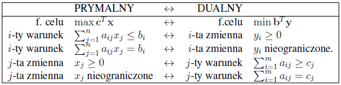

# Programowanie liniowe 3: Dualność

## Motywacja: certyfikat optymalności

Dla niektórych problemów znane są algorytmy, które wraz z rozwiązaniem generują tzw. certyfikat poprawności, czyli dodatkową informację z pomocą której możemy łatwo (tzn. algorytmem, który jest nie tylko wielomianowy, ale również istotnie prostszy od algorytmu generującego rozwiązanie) sprawdzić, czy  

zwrócone rozwiązanie jest poprawne (lub optymalne w przypadku problemów optymalizacyjnych). Algorytmy te określane są mianem *algorytmów certyfikujących*. Oto kilka przykładów:

- Algorytm sprawdzający, czy dany graf jest dwudzielny może zwracać 2-kolorowanie takiego grafu lub cykl nieparzysty.
- Algorytm znajdowania maksymalnego przepływu wraz z przepływem może zwracać minimalny przekrój.
- Istnieje algorytm testujący planarność grafów, który zwraca rysunek na płaszczyźnie bez przecięć krawędzi lub podgraf homeomorficzny z $K_{3,3}$ lub $K_5$.

Algorytmy certyfikujące oprócz znaczenia teoretycznego (aby generować takie certyfikaty należy dobrze zrozumieć problem) mają dużą wartość praktyczną: pomyślmy choćby o testowaniu poprawności kodu.

Czy dla programowania liniowego istnieją certyfikaty poprawności? Rozważmy decyzyjną wersję problemu programowania liniowego: mając dany (minimalizacyjny) PL i liczbę $\delta$ rozstrzygnąć, czy istnieje dopuszczalny $\mathbf{x}$ taki, że $\mathbf{c}^T\mathbf{x} \le \delta$. Załóżmy dla uproszczenia, że nasz program jest ograniczony. Wraz z odpowiedzią TAK algorytm certyfikujący może zwrócić współrzędne $\mathbf{x}$ (można nawet pokazać, że te współrzędne można reprezentować w pamięci wielomianowej względem rozmiaru danych). A więc istnieje certyfikat pozytywny. Z punktu widzenia teorii złożoności, dowodzi to, że problem jest w klasie NP. W dodatku algorytm weryfikacji certyfikatu jest banalny: po prostu sprawdzamy odpowiednie nierówności. Czy możemy podać certyfikat negatywny, tzn. certyfikat poprawności dla odpowiedzi NIE? Gdyby ten certyfikat był również krótki, mielibyśmy dowód, że programowanie liniowe jest w klasie co-NP.

W tym rozdziale przedstawimy pojęcie dualności programowania liniowego, które dostarcza odpowiedzi na powyższe pytania. Jak zobaczymy w kolejnych wykładach, dualność programowania liniowego ma dużo więcej konsekwencji w matematyce i informatyce.

## Poszukiwanie ograniczenia na wartość rozwiązania optymalnego

Rozważmy następujący PL w postaci standardowej:

Program (P1)  

$$
\begin{array}{ll}  

       \textrm{zmaksymalizuj}           & 3x_1 - x_2 + 2x_3  \\  

       \textrm{z zachowaniem warunków} & x_1 - x_2 + \frac{1}{2}x_3  \le  4 \\  

                                       & 4x_1 + 2x_2 + 3x_3 \le 20\\  

                                       & x_1,x_2,x_3\ge 0  

       \end{array}
$$

Łatwo sprawdzić, że punkt $(x_1=2,x_2=0,x_3=4)$ jest rozwiązaniem dopuszczalnym o wartości funkcji celu $14$.

Zauważmy, że skoro $x_1,x_2,x_3\ge 0$, to $3x_1 \le 4x_1$, a także $-x_2 \le 2x_2$ oraz $2x_3 \le 3x_3$. Stąd, $3x_1 - x_2 + 2x_3 \le 4x_1 + 2x_2 + 3x_3 \le 20$. Dostaliśmy górne ograniczenie! W tym przypadku możemy zauważyć nawet więcej. Ponieważ $3 \le 1+\frac{1}{2}\cdot 4$, $-1 \le -1+\frac{1}{2}\cdot 2$ oraz $2 \le \frac{1}{2}+\frac{1}{2}\cdot 3$, więc  

$$
\begin{split}  

\nonumber  

3x_1 - x_2 + 2x_3 \le&\; x_1 - x_2 + \frac{1}{2}x_3  \; + \\  

                     &\; \frac{1}{2}\cdot (4x_1 + 2x_2 + 3x_3) \le 4+\frac{1}{2}\cdot 20 = 14.  

\end{split}
$$

Udowodniliśmy (choć, trzeba przyznać, dość fartownie), że wartość funkcji celu nigdy nie przekracza $14$, a więc mamy certyfikat optymalności, w dodatku bardzo krotki (kilka nierówności) i prosty do sprawdzenia.  

Możemy to rozumowanie uogólnić: można brać dowolne kombinacje liniowe nierówności t.ż.:

- współczynniki kombinacji liniowej są nieujemne (bo inaczej odwrócą się kierunki nierówności),
- dla dowolnego $i$, współczynnik funkcji celu przy $x_i$ jest ograniczony z góry przez odpowiednią kombinację liniową współczynników przy $x_i$ w nierównościach.

Można to zapisać za pomocą programu liniowego:

Program (D1)  

$$
\begin{array}{ll}  

       \textrm{zminimalizuj}          & 4y_1 + 20y_2  \\  

       \textrm{z zachowaniem warunków} & y_1 + 4y_2 \ge 3 \\  

                                       & -y_1 + 2y_2 \ge -1\\  

                                       & \frac{1}{2}y_1+3y_2\ge 2\\  

                                       & y_1, y_2 \ge 0.  

       \end{array}
$$

Powyższy program będziemy nazywać *programem dualnym* do programu (P1). Ogólnie, dla programu (będziemy go nazywać programem *prymalnym*)

Program (P2)  

$$
\begin{array}{ll@{\hspace{15mm}}l}  

       \textrm{zmaksymalizuj}           & \sum_{j=1}^n c_jx_j &  \\  

       \textrm{z zachowaniem warunków} & \sum_{j=1}^n a_{ij}x_j \le b_i& i=1,\ldots,m\\  

                                       & x_j \ge 0&j=1,\ldots,n  

       \end{array}
$$

program dualny ma postać:

Program (D2)  

$$
\begin{array}{ll@{\hspace{15mm}}l}  

       \textrm{zminimalizuj}           & \sum_{i=1}^m b_iy_i &  \\  

       \textrm{z zachowaniem warunków} & \sum_{i=1}^m a_{ij}y_i \ge c_j& j=1,\ldots,n\\  

                                       & y_i \ge 0&i=1,\ldots,m.  

       \end{array}
$$

Zauważmy, że macierz współczynników ograniczeń programu (D2) jest transpozycją macierzy dla programu (P2) (porównaj też dla programów (P1) i (D1)). Daje to niezwykle prosty, mechaniczny sposób konstruowania programu dualnego. Mianowicie dla programu

$$
\begin{array}{ll@{\hspace{15mm}}l}  

       \textrm{zmaksymalizuj}           & \mathbf{c}^T\mathbf{x} &  \\  

       \textrm{z zachowaniem warunków} & \mathbf{A}\mathbf{x} \le \mathbf{b}&\\  

                                       & \mathbf{x} \ge \mathbf{0}&  

       \end{array}
$$

program dualny ma postać:

$$
\begin{array}{ll@{\hspace{15mm}}l}  

       \textrm{zminimalizuj}           & \mathbf{b}^T\mathbf{y} &  \\  

       \textrm{z zachowaniem warunków} & \mathbf{A}^T\mathbf{y} \ge \mathbf{c} \\  

                                       & \mathbf{y}\ge\mathbf{0}  

       \end{array}
$$

Dualność jest relacją symetryczną, tzn. mówimy także, że (P2) jest dualny do (D2). Innymi słowy, program dualny do programu dualnego to program prymalny.

## Słaba dualność i komplementarne warunki swobody

Pozostańmy przy programach w postaci standardowej. Z konstrukcji programu dualnego wynika następujący fakt (dla porządku podamy jednak dowód).

**Twierdzenie 1 [o słabej dualności]**  

Niech $\mathbf{x}$ i $\mathbf{y}$ będą dowolnymi rozwiązaniami dopuszczalnymi odpowiednio programów (P2) i (D2). Wówczas $\mathbf{c}^T \mathbf{x} \le \mathbf{b}^T \mathbf{y}$.

*Dowód*  

Ponieważ dla każdego $j=1,\ldots,n$, mamy $x_j\ge 0$ oraz $\sum_{i=1}^m a_{ij}y_i \ge c_j$, więc  

$$
(*)\quad\quad \quad\quad \quad\quad c_j x_j \le \left(\sum_{i=1}^m a_{ij}y_i\right) x_j \quad\quad \forall j=1,\ldots,n.
$$  

Podobnie, ponieważ dla każdego $i=1,\ldots,m$, mamy $y_i\ge 0$ oraz $\sum_{j=1}^n a_{ij}x_j \le b_i$, więc  

$$
(**)\quad\quad \quad\quad \quad\quad\left(\sum_{j=1}^n a_{ij}x_j\right) y_i \le b_i y_i \quad\quad \forall i=1,\ldots,m.
$$  

Stąd,  

$$
(***)\quad\quad \quad\quad \quad\quad\mathbf{c}^T\mathbf{x}=\sum_{j=1}^n c_jx_j\le \sum_{j=1}^n\left(\sum_{i=1}^m a_{ij}y_i\right) x_j=\sum_{i=1}^m\left(\sum_{j=1}^n a_{ij}x_j\right) y_i\le\sum_{i=1}^m b_i y_i = \mathbf{b}^T\mathbf{y}.
$$ ♦

Zastanówmy się, kiedy rozwiązania optymalne programu prymalnego (P2) i dualnego (D2) spotykają się, czyli $\mathbf{c}^T\mathbf{x}=\mathbf{b}^T\mathbf{y}$. Z dowodu twierdzenia o słabej dualności widzimy, że jest tak wtedy i tylko wtedy gdy obie nierówności w (***) są równościami. Tak może się wydarzyć tylko wtedy, gdy gdy wszystkie nierówności w (*) i (**) są równościami. To dowodzi następującego twierdzenia:

**Twierdzenie (o komplementarnych warunkach swobody)**  

Niech $\mathbf{x}$ i $\mathbf{y}$ będą rozwiązaniami dopuszczalnymi odpowiednio dla zadania prymalnego i dualnego w postaci standardowej. Rozwiązania $\mathbf{x}$ i $\mathbf{y}$ są oba optymalne wtedy i tylko wtedy gdy

- **prymalne komplementarne warunki swobody:** dla każdego $j=1,\ldots,n$ albo $x_j=0$ albo $\sum_{i=1}^m a_{ij}y_i=c_j$. (tzn. albo $x_j=0$ albo $j$-ta nierówność programu dualnego jest spełniona z równością.)
- **dualne komplementarne warunki swobody** dla każdego $i=1,\ldots,m$ albo $y_i=0$ albo $\sum_{j=1}^n a_{ij}x_j=b_i$. (tzn. albo $y_i=0$ albo $i$-ta nierówność programu prymalnego jest spełniona z równością.)

## Programy dualne do ogólnych programów liniowych

Nawet gdy program nie jest w postaci standardowej możemy napisać program dualny, kierując się tą samą zasadą: poszukujemy jak najlepszego górnego ograniczenia na wartość funkcji celu. Zobaczmy np. co się dzieje, gdy program zawiera równość:

$$
\label{eq:primal11}  

       \begin{array}{ll}  

       \textrm{zmaksymalizuj}           & 3x_1 - x_2 + 2x_3  \\  

       \textrm{z zachowaniem warunków} & x_1 - x_2 + \frac{1}{2}x_3  \le  4 \\  

                                       & - 4x_1 - 2x_2 - 3x_3 = -20\\  

                                       & x_1,x_2,x_3\ge 0  

       \end{array}
$$

Podobnie jak poprzednio, dodając pierwszy warunek pomnożony przez $y_1 = 1$ do drugiego warunku pomnożonego przez $y_2=-\frac{1}{2}$ dostajemy ograniczenie górne równe $14$. Zauważmy, że w kombinacji liniowej warunków, współczynniki dla nierówności muszą być nieujemne, natomiast dla równości mogą być dowolne (w tym przypadku wybraliśmy ujemny). Program dualny wygląda następująco:

$$
\label{eq:dual11}  

       \begin{array}{ll}  

       \textrm{zminimalizuj}          & 4y_1 + 20y_2  \\  

       \textrm{z zachowaniem warunków} & y_1 + 4y_2 \ge 3 \\  

                                       & -y_1 + 2y_2 \ge -1\\  

                                       & \frac{1}{2}y_1+3y_2\ge 2\\  

                                       & y_1\ge 0.  

       \end{array}
$$

A co by się stało, gdyby w programie prymalnym dodatkowo mogły się pojawiać zmienne bez warunku nieujemności? Rozważmy np.

$$
\label{eq:primal112}  

       \begin{array}{ll}  

       \textrm{zmaksymalizuj}           & 3x_1 - x_2 + 2x_3  \\  

       \textrm{z zachowaniem warunków} & x_1 - x_2 + \frac{1}{2}x_3  \le  4 \\  

                                       & 4x_1 + 2x_2 + 3x_3 = 20\\  

                                       & x_1,x_3\ge 0  

       \end{array}
$$  

 Wówczas nie możemy już napisać, że $3x_1 - x_2 + 2x_3 \le 4x_1 + 2x_2 + 3x_3$, gdyż niekoniecznie $-x_2 \le 2x_2$. Jeśli jednak pomnożymy pierwszą nierówność przez 3 i dodamy do drugiej, dostaniemy:

$$
\begin{split}  

\nonumber  

3x_1 - x_2 + 2x_3 \le&\; 3 (x_1 - x_2 + \frac{1}{2}x_3)  \; + \\  

                     &\; 4x_1 + 2x_2 + 3x_3 \le 12+20 = 32,  

\end{split}
$$  

gdyż $3x_1 \le 7x_1$, $-x_2 = -x_2$ oraz $2x_3\le 3x_3$. Znalezienie najlepszej kombinacji liniowej warunków odpowiada programowi:

$$
\label{eq:dual111}  

       \begin{array}{ll}  

       \textrm{zminimalizuj}          & 4y_1 + 20y_2  \\  

       \textrm{z zachowaniem warunków} & y_1 + 4y_2 \ge 3 \\  

                                       & -y_1 + 2y_2 = -1\\  

                                       & \frac{1}{2}y_1+3y_2\ge 2\\  

                                       & y_1\ge 0.  

       \end{array}
$$

Ogólnie, program dualny konstruujemy zgodnie z poniższą zasadą:

Tworzenie programów dualnych  

Można łatwo sprawdzić, że program dualny zbudowany zgodnie z powyższymi wytycznymi również spełnia twierdzenie o słabej dualności (a także twierdzenie o silnej dualności, które udowodnimy w kolejnym punkcie).

## Silna dualność

Twierdzenie o słabej dualności można również wyrazić w następujący sposób:

**Wniosek**  

Jeśli $z$ jest wartością funkcji celu rozwiązania optymalnego prymalnego minimalizacyjnego PL, natomiast $w$ jest wartością funkcji celu rozwiązania optymalnego  programu dualnego, to $z \ge w$.

Wynika stąd w szczególności, że gdy $z=w$, to rozwiązanie optymalne programu dualnego jest certyfikatem optymalności naszego rozwiązania programu prymalnego. Okazuje się, że tak jest *zawsze*!

**Twierdzenie (o silnej dualności)**  

Jeśli $z$ jest wartością funkcji celu rozwiązania optymalnego prymalnego PL, natomiast $w$ jest wartością funkcji celu rozwiązania optymalnego  programu dualnego, to $z = w$.

*Dowód*  

Dla uproszczenia przeprowadzimy dowód dla przypadku programu w maksymalizacyjnej postaci standardowej (dowód dla ogólnej postaci jest analogiczny). Oto program prymalny:

Program (P3)  

$$
\label{eq:st-primal-proof}  

       \begin{array}{ll@{\hspace{15mm}}l}  

       \textrm{zmaksymalizuj}           & \mathbf{c}^T\mathbf{x} &  \\  

       \textrm{z zachowaniem warunków} & \mathbf{A}\mathbf{x} \le \mathbf{b}&\\  

                                       & \mathbf{x} \ge \mathbf{0},&  

       \end{array}
$$

oraz program dualny:

Program (D3)  

$$
\label{eq:st-dual-proof}  

       \begin{array}{ll@{\hspace{15mm}}l}  

       \textrm{zminimalizuj}           & \mathbf{b}^T\mathbf{y} &  \\  

       \textrm{z zachowaniem warunków} & \mathbf{A}^T\mathbf{y} \ge \mathbf{c} \\  

                                       & \mathbf{y}\ge\mathbf{0}.  

       \end{array}
$$

Niech $\mathbf{x}^*$ będzie rozwiązaniem optymalnym programu prymalnego (P3). Ze słabej dualności, wystarczy pokazać rozwiązanie dopuszczalne $\mathbf{y}$ programu dualnego (D3) t.ż. $\mathbf{c}^T \mathbf{x}^* = \mathbf{b}^T \mathbf{y}$. Uruchamiamy algorytm simplex (patrz poprzedni [wykład](http://smurf.mimuw.edu.pl/drupal6/node/1122)) na programie (P3).  

W pierwszej iteracji algorytm simplex buduje program

Program (P3-start)  

$$
\label{eq:P_0}  

       \begin{array}{ll@{\hspace{15mm}}l}  

       \textrm{zmaksymalizuj}           & z &  \\  

       \textrm{z zachowaniem warunków} & z = \sum_{j=1}^n c_jx_j & \\  

                                       & x_{n+i}=b_i - \sum_{j=1}^n a_{ij}x_j & i=1,\ldots,m\\  

                                       & x_j \ge 0&j=1,\ldots,n+m.  

       \end{array}
$$

Rozważmy program z ostatniej iteracji algorytmu simplex.

Program (P3-stop)  

$$
\label{eq:P'}  

       \begin{array}{ll@{\hspace{15mm}}l}  

       \textrm{zmaksymalizuj}           & z &  \\  

       \textrm{z zachowaniem warunków} & z = v + \sum_{j\in N} c'_jx_j & \\  

                                       & x_i=b'_i-\sum_{j\in N} a'_{ij}x_j& i\in B\\  

                                       & x_j \ge 0&j=1,\ldots,n+m.  

       \end{array}
$$

Ponieważ program prymalny jest ograniczony, więc dla każdego $j\in N$, $c'_j \le 0$ oraz algorytm simplex zwraca rozwiązanie optymalne $\mathbf{x}^*$ takie, że  

$$
x^*_i = \left\{ \begin{array}{cl}  

                  0 & \text{gdy $i\in N$} \\  

                  b'_i & \text{gdy $i\in B$.}  

                 \end{array} \right.
$$

Określimy teraz pewne rozwiązanie programu dualnego (D3):  

$$
y_i := \left\{ \begin{array}{cl}  

                  -c'_{n+i} & \text{gdy $n+i\in N$} \\  

                  0 & \text{w p. p.}  

                 \end{array} \right.
$$

Pokażemy teraz, że $\mathbf{y}$ jest dopuszczalny o wartości funkcji celu równej $\mathbf{c}^T\mathbf{x}^*$. Określamy $c'_j:=0$ dla $j\in B$. Wówczas pierwszy warunek programu (P3-stop) możemy zapisać jako $z = v + \sum_{j=1}^{n+m} c'_jx_j$.

Weźmy **dowolne** $(x_1,\ldots,x_n)\in \mathbb{R}^n$. Określmy $x_{n+i} = b_i - \sum_{i=1}^n a_{ij}x_j$ oraz $z=\sum_{i=1}^n a_{ij}x_j$. Wówczas $(z,x_1,\ldots,x_{n+m})$ jest rozwiązaniem dopuszczalnym programu (P3-start). Ponieważ program (P3-stop) jest równoważny (P3-start), tzn. powstaje z  (P3-start) na drodze ciągu operacji elementarnych, więc $(z,x_1,\ldots,x_{n+m})$ jest również rozwiązaniem dopuszczalnym programu (P3-stop). Z faktu, iż w obu programach spełnione są warunki zawierające zmienną $z$ mamy, iż:  

$$
\begin{array}{rcl}  

\sum_{j=1}^n c_jx_j & = & v + \sum_{j=1}^{n+m} c'_jx_j \\  

                    & = & v + \sum_{j=1}^{n} c'_jx_j + \sum_{i=1}^{m} c'_{n+i}x_{n+i} \\  

                    & = & v + \sum_{j=1}^{n} c'_jx_j + \sum_{i=1}^{m} (-y_i)(b_i - \sum_{j=1}^n a_{ij}x_j).  

\end{array}
$$  

Po przegrupowaniu dostajemy, że dla dowolnego $(x_1,\ldots,x_n)\in \mathbb{R}^n$,  

$$
\sum_{j=1}^n c_jx_j = \left(v - \sum_{i=1}^{m} y_i b_i\right) + \sum_{j=1}^n \left(c'_j + \sum_{i=1}^m y_i a_{ij}\right) x_j.
$$

Podstawiamy $(x_1,\ldots,x_n) = (0,\ldots,0)$ i mamy $v = \sum_{i=1}^{m} y_i b_i$. Ponieważ $\mathbf{c}^T\mathbf{x}^* = v$, więc $\mathbf{c}^T\mathbf{x}^* = \mathbf{b}^T \mathbf{y}$. Pozostaje pokazać dopuszczalność $\mathbf{y}$. W tym celu rozważmy dowolne $k\in\{1,\ldots, n\}$. Podstawiamy $x_j=[j=k]$ dla każdego $j=1,\ldots,n$. Otrzymujemy  

$$
c_k = \underbrace{(v - \sum_{i=1}^{m} y_i b_i)}_{=0} + \underbrace{\quad c'_k\quad}_{\le 0} + \sum_{i=1}^m y_i a_{ik},
$$  

co implikuje $\sum_{i=1}^m y_i a_{ik} \ge c_k$ dla każdego $k$, czyli $\mathbf{A}^T \mathbf{y} \ge \mathbf{c}$. Zauważmy, że ponieważ $c'_j\le 0$ dla każdego $j$, więc $\mathbf{y} \ge 0$. Pokazaliśmy zatem, że $\mathbf{y}$ jest rozwiązaniem dopuszczalnym programu (D3) o wartości funkcji celu $\mathbf{c}^T\mathbf{x}^*$, co kończy dowód. ♦

Z powyższego dowodu wynika, że algorytm simplex znajduje równocześnie rozwiązania optymalne programu prymalnego i dualnego. W niektórych sytuacjach możemy uzyskać skrócenie czasu działania algorytmu stosując tzw. dualny algorytm simplex, tzn. uruchamiać algorytm simplex dla programu dualnego.
